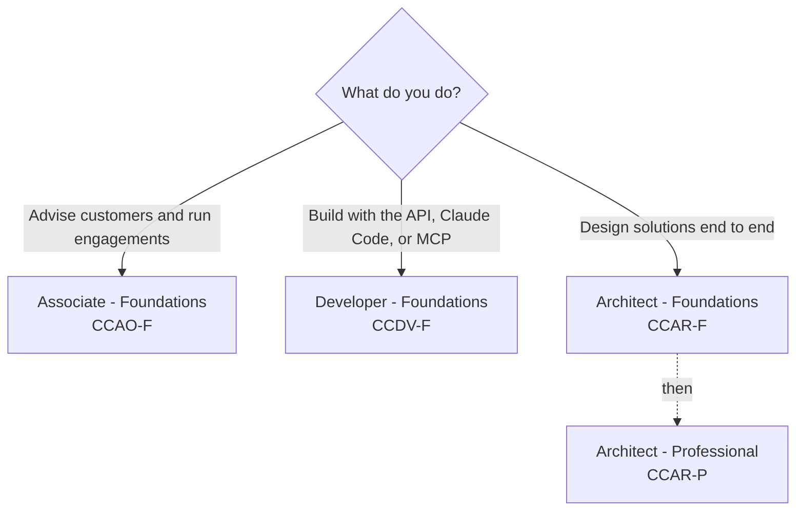

# Claude Certifications

**One place to prepare for every Anthropic Claude certification.**

Official exam guides, blueprints, policies, courses, and study notes,
collected and organized so you can spend your time studying, not searching.

[Website](https://amey-thakur.github.io/CLAUDE-CERTIFICATIONS/) · [Certifications](#the-certifications) · [Start here](#start-here) · [Program guide](guide/README.md) · [Credentials](#credentials-behind-this-guide) · [Discussions](https://github.com/Amey-Thakur/CLAUDE-CERTIFICATIONS/discussions)

**[Download the companion (PDF)](https://github.com/Amey-Thakur/CLAUDE-CERTIFICATIONS/releases/latest/download/claude-certifications-companion.pdf)** · the whole guide in one printable file

---

Built and maintained by [Amey Thakur](https://github.com/Amey-Thakur) after completing the program's curriculum. This is a community resource, not an official Anthropic repository: the official program lives on [Anthropic Partner Academy](https://anthropic-partners.skilljar.com/), and exams are delivered by [Pearson VUE](https://www.pearsonvue.com/us/en/anthropic.html).

> [!NOTE]
> I worked through every course and collected all of this while preparing myself. None of it required anything you do not already have: the official material is free, the blueprints tell you exactly what is tested, and the rest is steady work. I put it in one place so your time goes into learning rather than looking. If it helps you get certified, it did its job.
>
> — Amey Thakur

---

## The certifications

Each certification has its own folder containing the study guide, the official exam guide PDF, the maintainer's study notes, and original practice questions.

| Certification | Exam code | Questions | Fee | Study guide | Exam guide | Notes | Practice | Mocks | Cheat sheet |
| --- | :---: | :---: | :---: | --- | --- | --- | --- | --- | --- |
| Associate – Foundations | CCAO-F | 60 | $99 | [Guide](associate-foundations/README.md) | [PDF](associate-foundations/exam-guide.pdf) | [Notes](associate-foundations/notes.md) | [Questions](associate-foundations/practice-questions.md) | [1](associate-foundations/mock-exam-1.md) · [2](associate-foundations/mock-exam-2.md) · [3](associate-foundations/mock-exam-3.md) | [Sheet](associate-foundations/cheat-sheet.md) |
| Developer – Foundations | CCDV-F | 53 | $125 | [Guide](developer-foundations/README.md) | [PDF](developer-foundations/exam-guide.pdf) | [Notes](developer-foundations/notes.md) | [Questions](developer-foundations/practice-questions.md) | [1](developer-foundations/mock-exam-1.md) · [2](developer-foundations/mock-exam-2.md) · [3](developer-foundations/mock-exam-3.md) | [Sheet](developer-foundations/cheat-sheet.md) |
| Architect – Foundations | CCAR-F | 60 | $125 | [Guide](architect-foundations/README.md) | [PDF](architect-foundations/exam-guide.pdf) | [Notes](architect-foundations/notes.md) | [Questions](architect-foundations/practice-questions.md) | [1](architect-foundations/mock-exam-1.md) · [2](architect-foundations/mock-exam-2.md) · [3](architect-foundations/mock-exam-3.md) | [Sheet](architect-foundations/cheat-sheet.md) |
| Architect – Professional | CCAR-P | 63 | $175 | [Guide](architect-professional/README.md) | [PDF](architect-professional/exam-guide.pdf) | [Notes](architect-professional/notes.md) | [Questions](architect-professional/practice-questions.md) | [1](architect-professional/mock-exam-1.md) · [2](architect-professional/mock-exam-2.md) · [3](architect-professional/mock-exam-3.md) | [Sheet](architect-professional/cheat-sheet.md) |

Every exam: 120 minutes, closed book, proctored by Pearson VUE online or at a test center, passing score 720 of 1,000, credential valid 12 months with free renewal, badge via Credly. Fees are list prices in USD; partner tiers receive automatic discounts. Registration requires a Claude Partner Network company email.

> [!TIP]
> Every course in the program is free on the public [Claude Academy](https://academy.claude.com/), no partner account needed. Only the proctored exams require Claude Partner Network membership, so you can learn the whole syllabus before deciding whether to certify.
>
> Prefer one file? The whole guide is a printable companion: [claude-certifications-companion.pdf](https://github.com/Amey-Thakur/CLAUDE-CERTIFICATIONS/releases/latest/download/claude-certifications-companion.pdf), thirty-three pages in five parts: choose your exam, know it, prepare, sit it, and keep going.

 

> [!IMPORTANT]
> **The study material in one document: [Claude Certifications Study Guide](Claude%20Certifications%20Study%20Guide.pdf)**
>
> An independent study archive for the four certifications: the four study guides, the mock exams, the cheat sheets and the program guide gathered into a single file. It is a different document from the printable companion above, which flows this guide into five parts for printing; the archive is the study material itself, collected.
>
>  

---

## Start here

### 1. Pick your exam

| What you do | Start with |
| --- | --- |
| Advise customers and run engagements | [Associate, CCAO-F](associate-foundations/README.md) |
| Build with the API, Claude Code, or MCP | [Developer, CCDV-F](developer-foundations/README.md) |
| Design solutions end to end | [Architect Foundations, CCAR-F](architect-foundations/README.md), then [Architect Professional, CCAR-P](architect-professional/README.md) |

Not sure which fits? Read [how the certifications connect](guide/learning-paths.md).

### 2. Study

- Your exam's own **study guide** and **notes**, linked in the table above
- [Study strategy](guide/study-strategy.md), for a working plan rather than a reading list
- [The 24 official courses](guide/courses.md), with [per-course notes](guide/course-notes.md) and [official resources](guide/resources.md)
- [The practice engine](guide/quiz.md): shuffled, timed and scored, drawn from 320 original questions

Clone the repository and open Claude Code inside it, and the built-in
[exam coach skill](.claude/skills/exam-coach/SKILL.md) quizzes you straight from the blueprints.

### 3. Book and sit

- [Registration guide](guide/registration.md), covering partner email problems and the proctoring network allowlist
- [Policies](guide/policies.md), for retakes, validity and appeals
- [FAQ](guide/faq.md), for the short answers

---

## Flashcards

Every fact, domain weight, rule, and glossary term in this repository, as a deck of 110 cards. Turn them in the browser on the [flashcards page](https://amey-thakur.github.io/CLAUDE-CERTIFICATIONS/guide/flashcards.html), filtered by exam or by topic, or take [flashcards.tsv](flashcards.tsv) and import the whole deck into Anki, Quizlet, or RemNote.

 

---

## Credentials behind this guide

**All 25 of the Claude Academy courses and tutorials** behind the certification program, completed and independently verifiable. Not every one issues something to show: **22** carry a Skilljar verification record with a completion date, and **23** were issued a digital completion badge on [Claude Academy](https://academy.claude.com), Anthropic's own domain, **24** badges in all because one course issued twice.

This is here so you can check the material rather than trust it. Every claim in this repository traces to an official source; these show the curriculum behind it was worked through rather than summarized from the outside. Every badge below links to its own verification page.

> [!NOTE]
> **Two badges, one course.** AI Fluency for Creative Work was issued a completion badge on 22 August 2026 and again on 27 August 2026. Both verify on Anthropic's own domain, so both are shown: twenty-four badges across twenty-three courses.

<!-- badges:start -->

<table>
<tr>
<td align="center" width="33%">

 <b>Claude 101</b> <a href="https://academy.claude.com/verify/13103f134da7befe9615ec2adfc8c50e">Verify</a>
</td>
<td align="center" width="33%">

 <b>Claude Platform 101</b> <a href="https://academy.claude.com/verify/c916ad7d1190ea2447bb2fcf3809ef16">Verify</a>
</td>
<td align="center" width="33%">

 <b>Claude Code 101</b> <a href="https://academy.claude.com/verify/47482157d8dbc48e39d22aaa49d6d9b1">Verify</a>
</td>
</tr>
<tr>
<td align="center" width="33%">

 <b>Claude Code in Action</b> <a href="https://academy.claude.com/verify/7f0839f0576b57f38658e8784e4c9a83">Verify</a>
</td>
<td align="center" width="33%">

 <b>Introduction to Claude Cowork</b> <a href="https://academy.claude.com/verify/7e0320325938630d9536a61078cc69a9">Verify</a>
</td>
<td align="center" width="33%">

 <b>Building with the Claude API</b> <a href="https://academy.claude.com/verify/f6a1826e7f9054f5e41bf340a402fe58">Verify</a>
</td>
</tr>
<tr>
<td align="center" width="33%">

 <b>Introduction to Model Context Protocol</b> <a href="https://academy.claude.com/verify/0377c528acb2ecff93695ef9a9b56369">Verify</a>
</td>
<td align="center" width="33%">

 <b>Model Context Protocol: Advanced Topics</b> <a href="https://academy.claude.com/verify/f7904c762c678c6e136bc866545a47e4">Verify</a>
</td>
<td align="center" width="33%">

 <b>Introduction to agent skills</b> <a href="https://academy.claude.com/verify/f568ff531665f510978b957c865f2af4">Verify</a>
</td>
</tr>
<tr>
<td align="center" width="33%">

 <b>Introduction to subagents</b> <a href="https://academy.claude.com/verify/7c8ad2d367ff550c18bfb458cfcf5bd5">Verify</a>
</td>
<td align="center" width="33%">

 <b>Claude with Amazon Bedrock</b> <a href="https://academy.claude.com/verify/8fb5e32058c121d343c34e341f56f375">Verify</a>
</td>
<td align="center" width="33%">

 <b>Claude with Google Cloud's Vertex AI</b> <a href="https://academy.claude.com/verify/7ba0a150a9136308e1efa4b708fd9815">Verify</a>
</td>
</tr>
<tr>
<td align="center" width="33%">

 <b>AI Fluency: Framework &amp; Foundations</b> <a href="https://academy.claude.com/verify/707d8089647cf8c2a99e833811ef8411">Verify</a>
</td>
<td align="center" width="33%">

 <b>AI Capabilities and Limitations</b> <a href="https://academy.claude.com/verify/09810945e075b401092e66d40dca790b">Verify</a>
</td>
<td align="center" width="33%">

 <b>AI Fluency for Builders</b> <a href="https://academy.claude.com/verify/6b67e458243ba97237de011382e2bedf">Verify</a>
</td>
</tr>
<tr>
<td align="center" width="33%">

 <b>AI Fluency for educators</b> <a href="https://academy.claude.com/verify/3b7797440c1c56ed02ce4311c95313f1">Verify</a>
</td>
<td align="center" width="33%">

 <b>AI Fluency for pK-12 Educators</b> <a href="https://academy.claude.com/verify/e8df6427179f879404b68f93cdbbb1b6">Verify</a>
</td>
<td align="center" width="33%">

 <b>AI Fluency for students</b> <a href="https://academy.claude.com/verify/84c728c31bdfe38efa149672b5477163">Verify</a>
</td>
</tr>
<tr>
<td align="center" width="33%">

 <b>AI Fluency for nonprofits</b> <a href="https://academy.claude.com/verify/06b8ffc13e282f6c78d810d8a6575579">Verify</a>
</td>
<td align="center" width="33%">

 <b>AI Fluency for Small Businesses</b> <a href="https://academy.claude.com/verify/bf4fc4c30c02eb1d4aca988a212a44c8">Verify</a>
</td>
<td align="center" width="33%">

 <b>Teaching AI Fluency</b> <a href="https://academy.claude.com/verify/59092b63e1969a2cb07ac14a57bd13ed">Verify</a>
</td>
</tr>
<tr>
<td align="center" width="33%">

 <b>AI Fluency for Creative Work</b> <a href="https://academy.claude.com/verify/427635f5a6ca3fd34ed84bbdf7fb0275">Verify</a>
</td>
<td align="center" width="33%">

 <b>AI Fluency for Creative Work</b> <a href="https://academy.claude.com/verify/15dd1b6eef52c127e4e4111f1d15e72e">Verify</a>
</td>
<td align="center" width="33%">

 <b>Deploying Claude Enterprise with Confidence</b> <a href="https://academy.claude.com/verify/296e047c54c8ed404a99a7151c65ddf6">Verify</a>
</td>
</tr>
</table>

<!-- badges:end -->

**[All 22 certificates, with their PDFs and Skilljar records](certificates/README.md)**

| Track | Certificates | Academy badges | What it covers |
| --- | :---: | :---: | --- |
| [Claude platform](certificates/README.md#claude-platform) | 5 | 5 | Claude 101, the platform, Claude Code, and Cowork |
| [Developer and integration](certificates/README.md#developer-and-integration) | 5 | 3 | The API, Model Context Protocol, and building agents |
| [Deployment platforms](certificates/README.md#deployment-platforms) | 2 | 3 | Claude on Amazon Bedrock, Google Cloud Vertex AI, and Claude Enterprise rollout |
| [AI Fluency](certificates/README.md#ai-fluency) | 10 | 10 | The framework, and its versions for builders, educators, students, nonprofits and small businesses |

> [!NOTE]
> **A course certificate is not a certification credential, and this section claims only the first.** The 22 courses above are free, self-paced, and open to anyone on the public [Claude Academy](https://academy.claude.com/). The four certifications are separate: each requires a proctored Pearson VUE exam, a passing score of 720 of 1,000, and Claude Partner Network membership to register, and each is issued as a Credly badge that is valid for 12 months. The two are verified on different systems and should never be presented as the same thing.

---

## What is where

| Folder | Contents |
| --- | --- |
| [associate-foundations](associate-foundations/) · [developer-foundations](developer-foundations/) · [architect-foundations](architect-foundations/) · [architect-professional](architect-professional/) | One folder per certification: study guide, official exam guide PDF, study notes, practice questions |
| [guide](guide/) | Program-wide pages: learning paths, study strategy, official resources, practice, registration, policies, FAQ, and glossary, plus the official policy PDFs and their [provenance](guide/official-sources.md) |
| [certificates](certificates/) | The maintainer's 22 Claude Academy course certificates, with previews and verification links |
| [.github](.github/) | Repository housekeeping: CI, templates, logo assets, and the [script](.github/scripts/update_resources.py) that keeps mirrored PDFs current |

---

## Questions and community

Ask questions, share how your exam went, and compare preparation notes in [Discussions](https://github.com/Amey-Thakur/CLAUDE-CERTIFICATIONS/discussions). Found a broken link or an outdated fact? [Open an issue](https://github.com/Amey-Thakur/CLAUDE-CERTIFICATIONS/issues/new/choose).

> [!IMPORTANT]
> Every candidate accepts a non-disclosure agreement covering exam questions, answer options, and scenarios. It forbids publishing or posting that content anywhere, which includes forums like this one. Never post or request real exam content here. Blueprints, official sample questions, and the practice material in this repository are all fair game.

Preparing someone else? The [share kit](guide/share.md) has the links, ready-to-use copy, and images.

Contributions that keep facts current are welcome; see [CONTRIBUTING.md](.github/CONTRIBUTING.md).

---

<a href="https://www.anthropic.com" title="Anthropic">
<picture>
  <source media="(prefers-color-scheme: dark)" srcset=".github/assets/logos/anthropic-wordmark-dark.svg">
  
</picture>
</a>

Not affiliated with or endorsed by Anthropic. Claude and Anthropic are trademarks of Anthropic PBC. 
Repository text is <a href="LICENSE">MIT licensed</a>; mirrored documents and logo artwork keep their own provenance
(<a href="guide/official-sources.md">sources</a>, <a href=".github/assets/logos/README.md">logos</a>).

Facts last verified against the official sources on 2026-09-05.

