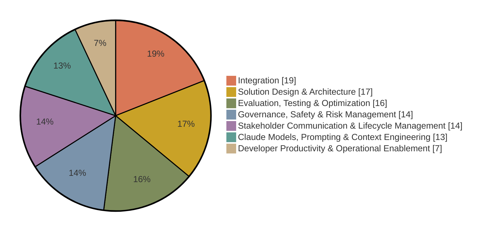

# Claude Certified Architect – Professional

The Claude Certified Architect – Professional certification validates that an individual can design, build, and deliver production-grade AI solutions on the Claude platform: selecting models, architectures, and API patterns; applying prompt and context engineering; integrating Claude into enterprise systems; and incorporating evaluation, security, compliance, and governance into designs. Anthropic summarizes the distinction from Foundations this way: Foundations proves an architect can build with Claude, Professional proves they can design and govern Claude solutions at enterprise scale.

This page condenses the official exam guide and program pages. The [exam guide](exam-guide.pdf) (version 1.0, effective July 2026) is the authoritative reference, and the maintainer's study notes for this exam are in [notes.md](notes.md), with original practice questions in [practice-questions.md](practice-questions.md) and a timed [mock exam](mock-exam-1.md). The [cheat sheet](cheat-sheet.md) condenses this whole page to one printable page for the day before.

## Exam facts

| Item | Detail |
| --- | --- |
| Exam code | CCAR-P |
| Questions | 63 multiple-choice and multiple-response items |
| Time limit | 120 minutes, with about 135 minutes of total seat time |
| Delivery | Pearson VUE, online proctored or at a test center |
| Passing score | 720 on a scaled range of 100 to 1,000 |
| Fee | 175 USD, before any [partner-tier discount](../guide/faq.md#pricing-and-discounts) |
| Validity | 12 months from the date you earn it |
| Prerequisites | None. Architect – Foundations is not required and does not upgrade into Professional |
| Language | English |

Registration requires a partner company email address recognized in the Claude Partner Network. This certification counts toward Claude Partner Network tier eligibility.

## Audience

The certification is intended for mid- to senior-level professionals who design and deliver production LLM solutions: solution architects, AI and ML engineers, technical leads, and senior software engineers. These practitioners translate business problems into scalable AI systems, lead architectural decisions, and engage stakeholders on security, legal, and executive concerns, typically across industries such as financial services, healthcare, retail, technology, education, and government.

It is not intended for entry-level developers, casual users, or roles limited to isolated tasks such as prompt writing without broader system design responsibility.

## Recommended experience

The exam guide recommends, but does not require:

- A foundation in software engineering best practices: modular design, separation of concerns, scalability
- Three or more years in systems architecture or platform engineering
- Six or more months of hands-on experience with Claude or comparable LLM systems in production
- Experience delivering end-to-end systems from discovery through deployment and operation

## Skills measured

| # | Domain | Weight |
| :---: | --- | :---: |
| 1 | Solution Design & Architecture | 17% |
| 2 | Claude Models, Prompting & Context Engineering | 13% |
| 3 | Integration | 19% |
| 4 | Evaluation, Testing & Optimization | 16% |
| 5 | Governance, Safety & Risk Management | 14% |
| 6 | Stakeholder Communication & Lifecycle Management | 14% |
| 7 | Developer Productivity & Operational Enablement | 7% |

Summary of what each domain tests. The full objective lists are in section 6 of the exam guide.

1. **Solution Design & Architecture.** Translating business problems into Claude-based solutions; designing end-to-end architectures with feedback loops; choosing among workflow, agentic, and augmented-LLM patterns; multi-agent orchestration; aligning designs to business value and performance SLAs.
2. **Claude Models, Prompting & Context Engineering.** Model selection tradeoffs, system prompt and guardrail design, zero-shot to chain-of-thought techniques, context window and token optimization, and prompt reuse through caching, modular prompts, and Skills.
3. **Integration.** The heaviest domain. Tool and agent configuration review for capability bloat, authentication and authorization analysis, accuracy-latency tradeoffs, observability at scale, RAG pipeline design with chunking and indexing strategy, retrieval matched to data shape, protocol selection (MCP, API and CLI, agent-to-agent), and progressive discovery versus monolithic context.
4. **Evaluation, Testing & Optimization.** Metric definition across accuracy, latency, cost, safety, and security; evaluation datasets and mixed-methodology test frameworks; A/B testing; diagnosing prompt failure, hallucination, and model mismatch; monitoring through logging and observability tooling.
5. **Governance, Safety & Risk Management.** Guardrails and safety controls, failure mode identification, human-in-the-loop validation, regulatory compliance including GDPR, HIPAA, and FedRAMP, and ethical considerations of bias, fairness, and transparency.
6. **Stakeholder Communication & Lifecycle Management.** Structured discovery, communicating architectural decisions and tradeoffs, managing expectations and SLAs, documenting architectures, and supporting the lifecycle from discovery to iteration.
7. **Developer Productivity & Operational Enablement.** Configuring Claude tooling for teams, improving developer workflows with AI-assisted tooling, and supporting debugging and operational issues.

## Official documents

| Document | Local copy | Source |
| --- | --- | --- |
| Exam guide | [PDF](exam-guide.pdf) | [Partner Academy certifications page](https://anthropic-partners.skilljar.com/page/partner-certifications) |
| Exam policy | [PDF](../guide/anthropic-certification-exam-policy.pdf) | Same page |
| Terms and conditions | [PDF](../guide/certification-terms-and-conditions.pdf) | Same page |

Registration: [Claude Certified Architect – Professional Certification](https://anthropic-partners.skilljar.com/claude-certified-architect-professional-certification). Prep courses: [Architect – Professional prep path](https://anthropic-partners.skilljar.com/path/claude-certified-architect-professional) (5 courses). The registration process itself is described in [Registration and scheduling](../guide/registration.md).

## Preparing

Everything above restates official material. The advice below is this repository's recommendation.

1. Read the exam guide in full and self-assess against every objective in section 6. Integration (19%), Solution Design (17%), and Evaluation (16%) together are more than half the exam.
2. Complete the [Architect – Professional prep path](https://anthropic-partners.skilljar.com/path/claude-certified-architect-professional). The guide also directs candidates to the official documentation for the Claude API, models, prompt engineering, MCP, and Skills.
3. Build and operate at least one end-to-end Claude solution that includes RAG, evaluation, and observability. The guide sets this as the preparation bar; the exam tests judgment that is difficult to acquire from reading alone.
4. Rehearse architectural decision-making: model selection, integration protocol choice, and security tradeoffs. Two domains, Governance and Stakeholder Communication, reward the ability to justify decisions, not only to make them.
5. Work the three sample questions in section 8 and read the rationale for each.

Points worth noting before you schedule:

- Sample rationales reward removing unneeded agent capabilities outright under least privilege rather than logging or confirming their use, ordering static prompt content first and enabling prompt caching to cut both latency and cost, and suspecting the retrieval and indexing layer first when a RAG system degrades after a document refresh.
- Stakeholder Communication & Lifecycle Management at 14% is unusual among technical certifications. Discovery, documentation, and expectation management are scored material.
- The exam is closed book, in English only, with no practice exam available.

## Related certifications

- [Claude Certified Architect – Foundations](../architect-foundations/README.md), the natural starting point for the architect track
- [Claude Certified Developer – Foundations](../developer-foundations/README.md), for hands-on implementation depth
- [Claude Certified Associate – Foundations](../associate-foundations/README.md), for non-developers who apply Claude to business workflows

---

Facts last verified against the official sources on 2026-09-05. [Repository index](../README.md)
