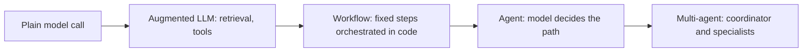
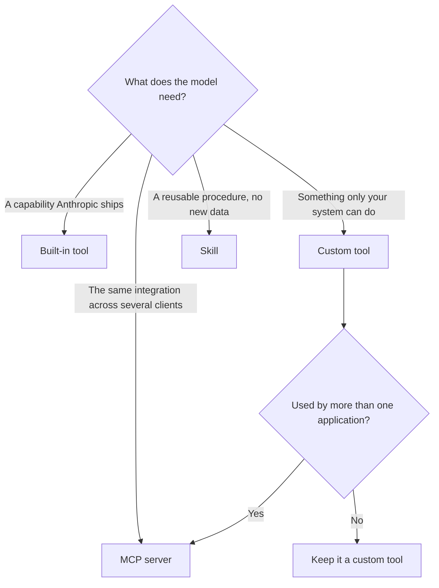

# Study notes: Architect – Professional

My working notes from preparing for this exam. It is the broadest of the four: less about any single API mechanic, more about defensible end-to-end design. Nothing here comes from the live exam, which is covered by a non-disclosure agreement; everything traces to the [exam guide](exam-guide.pdf).

## The pattern ladder

Most design questions reduce to picking the cheapest reliable structure:

Move right only when the left rung demonstrably cannot meet the requirement. An exam answer that adds agents, capabilities, or model size without a stated need is usually the wrong one; the sample rationales consistently reward removing what is unnecessary.

## Integration (19%), the heaviest domain

**Choosing what to build with.** The heaviest domain on the paper, and the
decision it keeps testing is which mechanism fits, not how to wire one up.

Capability bloat is the failure mode on the other side: every tool you add makes
every other tool slightly harder to choose correctly.

- **Least privilege is the reflex**: strip tools and permissions a role does not need, entirely. Logging and confirmation prompts are compensating controls, not substitutes for removal.
- **RAG design**: chunking should follow document structure, indexing and retrieval should match the data shape and query pattern, and hybrid retrieval exists for a reason. The classic failure: confident wrong answers after a document refresh point at retrieval and indexing, not the model.
- **Protocol selection**: MCP for reusable model-facing capabilities, direct API or CLI integration for fixed pipelines, agent-to-agent when autonomous systems must interoperate. Progressive discovery of tools beats loading a monolithic context when the tool surface is large.
- **Observability at scale** is designed in: traces of tool calls and decisions, not just final outputs, or production failures cannot be isolated to a layer.

## Evaluation (16%)

- Metrics span accuracy, latency, cost, safety, and security; pick them per use case and set them before building.
- Evaluation datasets need coverage of edge cases and mixed methodology: exact checks where truth is crisp, rubric or model-graded where it is not, human review where stakes demand it.
- A/B tests justify changes; regression suites keep model or prompt updates honest. Diagnosis order for degradation: data and retrieval first, then prompts, then model mismatch.

## Models, prompting, and context (13%)

- Model selection is a cost-latency-quality tradeoff argued from the task, not brand preference.
- The caching answer generalizes: static content first, dynamic last, cache the prefix; it cuts latency and cost simultaneously and appears in the official samples.
- Prompt reuse at enterprise scale means modular prompts, versioning, and Skills, so behavior changes are reviewable events rather than silent drift.

## Governance and safety (14%)

- Layer guardrails: input validation, output filtering, scoped permissions, human-in-the-loop for consequential actions. One layer is a single point of failure.
- Human-in-the-loop goes where errors are costly or irreversible; confidence-based routing keeps it affordable.
- Regulatory mapping in one line each: GDPR governs personal data of EU persons (minimization, purpose, erasure), HIPAA governs US health information, FedRAMP governs US federal cloud deployments. Know which applies to a scenario and what it forces in the design.
- Ethics is scored concretely: bias testing, fairness across user groups, transparency about AI involvement.

## Stakeholders and lifecycle (14%), the underrated domain

- Structured discovery before design: business problem, constraints, success measures, then architecture.
- Decisions get documented with their tradeoffs (an architecture decision record is the natural form), expectations get managed with explicit SLAs, and handoff includes implementation guidance, not just diagrams.
- Lifecycle thinking continues past deployment: monitoring, feedback loops, and iteration are part of the design, and the exam treats communication about all of this as a technical skill.

## Developer productivity (7%)

- Team-level Claude tooling: shared Claude Code configuration, standardized prompts and Skills, and AI-assisted debugging workflows. Small domain; do not overspend on it.

## Recall list

63 questions, 120 minutes, 720 of 1,000 to pass, $175 list, counts toward partner tier, no prerequisite (Architect Foundations is recommended order only), credential valid 12 months with free renewal, retake waits of 14, 30, then 90 days.

---

These notes are the maintainer's own summary and carry no official standing. [Study guide](README.md) · [Repository index](../README.md)
