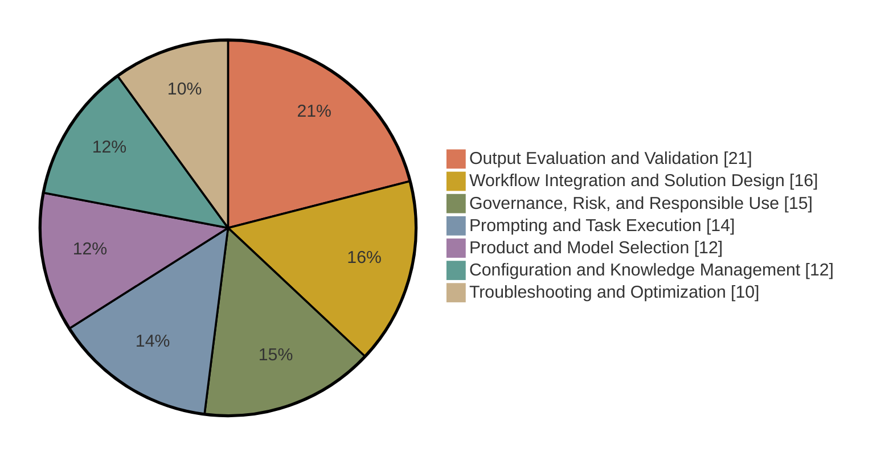

# Claude Certified Associate – Foundations

The Claude Certified Associate – Foundations certification validates that an individual can apply Claude to complete business and productivity tasks with minimal guidance. It covers using built-in platform features to streamline workflows, identifying opportunities to improve processes, selecting approaches that balance quality, efficiency, and cost, and recognizing when to escalate technical work to a Claude Developer or Architect.

This page condenses the official exam guide and program pages. The [exam guide](exam-guide.pdf) (version 1.0, effective July 2026) is the authoritative reference, and the maintainer's study notes for this exam are in [notes.md](notes.md), with original practice questions in [practice-questions.md](practice-questions.md) and a timed [mock exam](mock-exam-1.md). The [cheat sheet](cheat-sheet.md) condenses this whole page to one printable page for the day before.

## Exam facts

| Item | Detail |
| --- | --- |
| Exam code | CCAO-F |
| Questions | 60 multiple-choice and multiple-response items |
| Time limit | 120 minutes, with about 135 minutes of total seat time |
| Delivery | Pearson VUE, online proctored or at a test center |
| Passing score | 720 on a scaled range of 100 to 1,000 |
| Fee | 99 USD, before any [partner-tier discount](../guide/faq.md#pricing-and-discounts) |
| Validity | 12 months from the date you earn it |
| Prerequisites | None. No course is required |
| Language | English |

Registration requires a partner company email address recognized in the Claude Partner Network. This certification does not count toward Claude Partner Network tier eligibility; the Developer and Architect exams do.

## Audience

The certification is intended for professionals who use Claude as a productivity tool in roles such as operations, marketing, project management, education, communications, and consulting. Candidates sit between casual prompt users and technical practitioners: they translate business objectives into effective Claude interactions, evaluate generated content critically, and know when human review or escalation is required.

It is not intended for software developers building against APIs or designing agentic systems. That scope belongs to the [Developer](../developer-foundations/README.md) and [Architect](../architect-foundations/README.md) certifications.

## Recommended experience

The exam guide recommends, but does not require:

- Regular, hands-on experience using Claude in a professional setting
- A foundational understanding of structured problem solving, workflow design, and digital tools
- Experience in a role such as business analyst, project manager, operations lead, or consultant
- A practical understanding of AI limitations, including hallucinations, context constraints, and data sensitivity

## Skills measured

| # | Domain | Weight |
| :---: | --- | :---: |
| 1 | Prompting and Task Execution | 14% |
| 2 | Output Evaluation and Validation | 21% |
| 3 | Product and Model Selection | 12% |
| 4 | Workflow Integration and Solution Design | 16% |
| 5 | Configuration and Knowledge Management | 12% |
| 6 | Governance, Risk, and Responsible Use | 15% |
| 7 | Troubleshooting and Optimization | 10% |

Summary of what each domain tests. The full objective lists are in section 6 of the exam guide.

1. **Prompting and Task Execution.** Writing effective prompts, decomposing complex requests, iterating to improve output, and adapting strategy to the task type.
2. **Output Evaluation and Validation.** Checking outputs for accuracy and completeness, identifying hallucinations and bias, applying fact-checking, deciding when human review is needed, and adapting outputs for the intended audience. This is the heaviest domain.
3. **Product and Model Selection.** Choosing among product features such as Projects, research mode, and Artifacts; differentiating Haiku, Sonnet, and Opus; aligning model choice with cost, speed, and quality; managing context limitations.
4. **Workflow Integration and Solution Design.** Analyzing requirements, using Claude for research and planning, integrating it into existing workflows, and communicating its value and limits to stakeholders.
5. **Configuration and Knowledge Management.** Configuring Projects with instructions and knowledge sources, managing connectors such as Google Drive and Gmail, and maintaining system-level instructions.
6. **Governance, Risk, and Responsible Use.** Identifying appropriate use cases, applying data sensitivity and privacy considerations, and following organizational AI policy.
7. **Troubleshooting and Optimization.** Diagnosing underperforming prompts, adjusting based on feedback, and optimizing workflows.

## Official documents

| Document | Local copy | Source |
| --- | --- | --- |
| Exam guide | [PDF](exam-guide.pdf) | [Partner Academy certifications page](https://anthropic-partners.skilljar.com/page/partner-certifications) |
| Exam policy | [PDF](../guide/anthropic-certification-exam-policy.pdf) | Same page |
| Terms and conditions | [PDF](../guide/certification-terms-and-conditions.pdf) | Same page |

Registration: [Claude Certified Associate – Foundations Certification](https://anthropic-partners.skilljar.com/claude-certified-associate-foundations-certification). Prep courses: [Associate – Foundations prep path](https://anthropic-partners.skilljar.com/path/claude-certified-associate-foundations) (8 courses). The registration process itself is described in [Registration and scheduling](../guide/registration.md).

## Preparing

Everything above restates official material. The advice below is this repository's recommendation.

Suggested order of work:

1. Read the exam guide in full, then self-assess against each objective in section 6. The guide states it is the authoritative scope; anything not in the blueprint is not on the exam.
2. Complete the [Associate prep courses](https://anthropic-partners.skilljar.com/path/claude-certified-associate-foundations) on Partner Academy.
3. Build something real: configure a Project with instructions and knowledge sources, run a workflow through it, and review the outputs for accuracy and bias. The exam rewards applied judgment over recall.
4. Review the Anthropic documentation for Projects, Artifacts, Memory, and Skills.
5. Work the three sample questions in section 8 of the exam guide and read the rationale for each answer, including why the wrong options are wrong.

Points that commonly surprise candidates, all drawn from the official documents:

- Output Evaluation and Validation is the largest domain at 21%. Prompting is only 14%.
- Sample rationales reward verifying claims against authoritative sources rather than trusting model confidence, matching the model tier to the task rather than defaulting to the largest model, and anonymizing regulated data before upload rather than relying on instructions to the model.
- The exam is closed book. Notes, documentation, and browser translation tools are not permitted.
- There is no practice exam. The sample questions in the guide are the only official items available.

## Related certifications

- [Claude Certified Developer – Foundations](../developer-foundations/README.md), for engineers who build with the API, Claude Code, and MCP
- [Claude Certified Architect – Foundations](../architect-foundations/README.md), for practitioners who design solutions and weigh implementation tradeoffs
- [Claude Certified Architect – Professional](../architect-professional/README.md), for architects who govern production systems at enterprise scale

---

Facts last verified against the official sources on 2026-09-05. [Repository index](../README.md)
