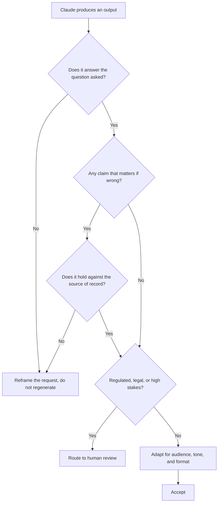

# Study notes: Associate – Foundations

My working notes from preparing for this exam, organized by blueprint domain. They condense what matters; they do not replace the [exam guide](exam-guide.pdf), and nothing here comes from the live exam, which is covered by a non-disclosure agreement.

How to use these notes: read the [study guide](README.md) first for the facts and blueprint, then work through this page domain by domain, checking that every line reads as obvious to you. Anything that does not is a study target.

## Domain 2 first: output evaluation (21%)

**The largest domain on this paper is checking, not producing.** The exam tests
whether you can tell a wrong answer from a right one, which is a different
skill from getting an answer at all.

Regenerating is the reflex and rarely the fix. If the output was wrong because
the request was ambiguous, a second attempt is a second guess.

The largest domain, so it earns the first slot. The mindset the exam rewards is professional skepticism applied cheaply:

- Treat every specific-looking detail in an output (citation numbers, statistics, names, dates) as unverified until checked against an authoritative source. Confident tone and self-reported confidence are not accuracy signals.
- Know the common failure shapes: fabricated specifics, plausible-but-wrong summaries, silent omissions, and bias inherited from framing.
- The verification workflow worth internalizing: identify claims that would matter if wrong, check those against the source of record, and route anything regulated, legal, or high-stakes to human review.
- Adapting output for an audience (tone, format, length, artifact versus inline) is scored material, not an afterthought.

## Prompting and task execution (14%)

- Structure beats cleverness: state the role, the task, the context, the constraints, and the output format. Decompose big requests into steps rather than one sprawling prompt.
- Iteration is the method: inspect what is wrong with an output, change one thing, rerun. Different task types (analysis, research, drafting, brainstorming) justify different strategies, and the exam expects you to match them.

## Product and model selection (12%)

The tradeoff table to know cold:

| Model | Character | Fits |
| --- | --- | --- |
| Haiku | Fastest, lowest cost | High-volume, straightforward tasks |
| Sonnet | Balanced | Most day-to-day work |
| Opus | Most capable, highest cost and latency | Complex reasoning that justifies the spend |

- Feature selection is tested the same way: Projects for recurring context, research mode for sourced answers, Artifacts for documents and structured deliverables, plain chat for quick tasks.
- Context is finite. Know when to start a fresh conversation, when to summarize and carry forward, and when to persist knowledge in a Project instead of re-pasting it.

## Workflow integration and solution design (16%)

- The valued skill is translating a business problem into a Claude workflow: analyze the requirement, pick where Claude adds value, integrate it into the existing process rather than around it, and be able to state its value and limits to a stakeholder plainly.
- Redesign beats bolt-on: the exam guide's own language is process reimagination, not just task automation.

## Configuration and knowledge management (12%)

- Projects: instructions define behavior, knowledge sources define what it knows. Keep instructions short, specific, and maintained; stale knowledge is a quality bug you own.
- Connectors (Google Drive, Gmail) extend reach; managing what is connected is part of governance, not just convenience.

## Governance, risk, and responsible use (15%)

- The pattern the sample questions reward: make the task safe, then do it. Anonymize or redact regulated identifiers before upload rather than abandoning the task or trusting an instruction to the model to compensate.
- Know your organization's data classes and which may never leave approved systems. "Instruct Claude not to retain it" is not a control.
- Appropriate-use judgment is tested: some tasks are wrong for AI in your context regardless of capability.

## Troubleshooting and optimization (10%)

- Diagnose before rewriting: is the failure missing context, ambiguous instruction, wrong feature, or wrong model? Fix the identified cause, not everything at once.
- Optimization means cheaper and faster at equal quality: reusable prompts, Projects for repeated context, and the smallest model that holds quality.

## Recall list

Facts worth having instantly available on exam day: 60 questions, 120 minutes, 720 of 1,000 to pass, closed book, results on screen immediately, badge via Credly, credential valid 12 months with a free renewal assessment, retake waits of 14, 30, then 90 days, and the Associate exam does not count toward partner tier eligibility.

---

These notes are the maintainer's own summary and carry no official standing. [Study guide](README.md) · [Repository index](../README.md)
