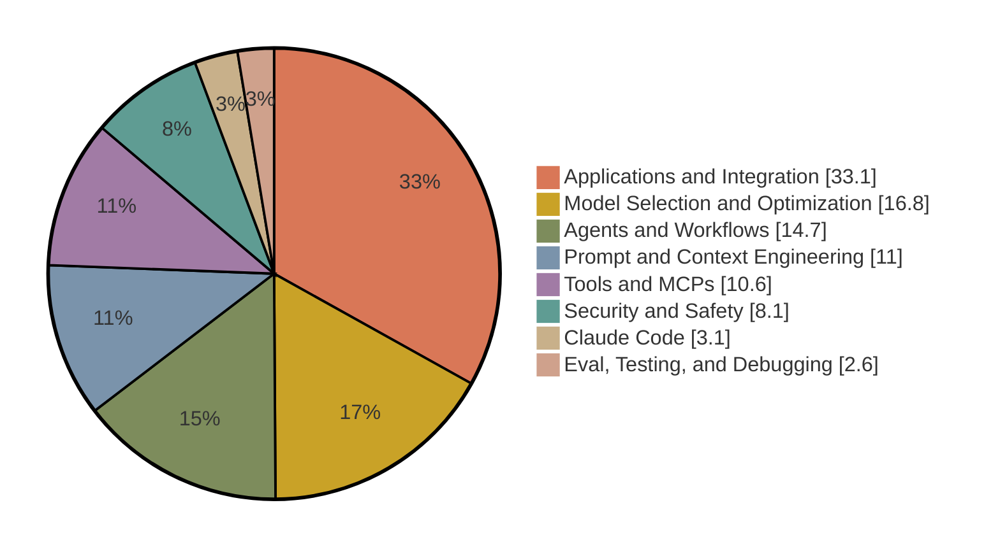

# Claude Certified Developer – Foundations

The Claude Certified Developer – Foundations certification validates that an individual can build, integrate, and ship production-grade applications, agents, and workflows on the Claude platform. It covers the Claude API and client SDKs, the Claude Agent SDK, Claude Code, prompt and context engineering, evaluation and debugging, model selection and cost management, security, and tool and MCP development.

This page condenses the official exam guide and program pages. The [exam guide](exam-guide.pdf) (version 1.0, effective July 2026) is the authoritative reference, and the maintainer's study notes for this exam are in [notes.md](notes.md), with original practice questions in [practice-questions.md](practice-questions.md) and a timed [mock exam](mock-exam-1.md). The [cheat sheet](cheat-sheet.md) condenses this whole page to one printable page for the day before.

## Exam facts

| Item | Detail |
| --- | --- |
| Exam code | CCDV-F |
| Questions | 53 multiple-choice and multiple-response items |
| Time limit | 120 minutes, with about 135 minutes of total seat time |
| Delivery | Pearson VUE, online proctored or at a test center |
| Passing score | 720 on a scaled range of 100 to 1,000 |
| Fee | 125 USD, before any [partner-tier discount](../guide/faq.md#pricing-and-discounts) |
| Validity | 12 months from the date you earn it |
| Prerequisites | None. No course is required |
| Language | English |

Registration requires a partner company email address recognized in the Claude Partner Network. This certification counts toward Claude Partner Network tier eligibility.

## Audience

The certification is intended for technical professionals who build and ship LLM-based systems: AI and machine learning engineers, technical leads, and senior software engineers working between business requirements and implementation. It is not intended for non-technical users, for people without hands-on software development experience, or for roles limited to prompt writing alone.

## Recommended experience

The exam guide recommends, but does not require:

- One to five years of software engineering experience
- At least six months of hands-on experience with Claude or comparable LLM-based systems
- Proficiency in Python and/or TypeScript
- Fluency with REST APIs and CLI tools
- A working understanding of LLM fundamentals, agents, context management, and MCP

## Skills measured

| # | Domain | Weight |
| :---: | --- | :---: |
| 1 | Agents and Workflows | 14.7% |
| 2 | Applications and Integration | 33.1% |
| 3 | Claude Code | 3.1% |
| 4 | Eval, Testing, and Debugging | 2.6% |
| 5 | Model Selection and Optimization | 16.8% |
| 6 | Prompt and Context Engineering | 11.0% |
| 7 | Security and Safety | 8.1% |
| 8 | Tools and MCPs | 10.6% |

Unlike the other exams, this blueprint publishes a weight for every individual skill. The share of the overall exam is shown in parentheses.

**Domain 1: Agents and Workflows (14.7%)**

- Agent architecture (4.5%): workflow versus agent decision criteria, manager and supervisor hierarchies, the role of subagents
- Agent construction (5.3%): the Claude Agent SDK, custom agent loops and harnesses, self-hosted versus Anthropic-hosted managed agents, hooks for deterministic actions
- Agent patterns and frameworks (4.9%): tool-use loops, subagents, memory, context-window management, and abstraction frameworks such as Strands, LangGraph, and PydanticAI

**Domain 2: Applications and Integration (33.1%)**

- Understanding requirements (3.4%) and systems life cycle management (2.8%)
- Claude API mechanics (6.8%): messages, tools, streaming, vision, thinking, caching, third-party vendors, batch versus realtime selection
- Software engineering foundations (7.4%): REST, JSON, asynchronous programming, version control, code review, refactoring
- Claude application design (8.6%): how Claude interprets instructions across Claude Code, Desktop, claude.ai, the API, and SDKs; content boundaries; schema design; session hygiene; plugin management
- Configuration management (4.1%): CLAUDE.md files, settings.json, model version pinning, prompt versioning, plugin dependencies

**Domain 3: Claude Code (3.1%)**

- Core components (Rules, Skills, Commands, Agents, Agent Memory), session management, slash commands, headless and streaming modes, the CLAUDE.md hierarchy, and settings.json

**Domain 4: Eval, Testing, and Debugging (2.6%)**

- Error type identification, recovery strategies, trace analysis, and isolating problems between the integration layer and model output

**Domain 5: Model Selection and Optimization (16.8%)**

- LLM fundamentals (5.2%): tokens, context windows, sampling, non-determinism, fast mode, extended and adaptive thinking, effort levels, zero-shot to multi-shot prompting
- Technical fundamentals (6.1%): SDKs wrapping REST APIs, websockets
- Model selection and tradeoffs (2.7%): Opus, Sonnet, and Haiku use cases; quality, latency, and cost; breaking behavior changes across releases
- Cost and token management (2.8%): usage tracking, cost modeling, prompt caching and cache checkpointing

**Domain 6: Prompt and Context Engineering (11.0%)**

- Context engineering (3.8%): context-window management, preventing drift and bloat, tool output pruning, compaction, context isolation through subagents
- Prompt engineering (4.6%): instruction clarity, few-shot examples, system versus user placement, output constraints, iterative refinement, input sanitization
- Output handling (2.6%): structured output patterns, response validation, defensive parsing, skepticism toward confident output

**Domain 7: Security and Safety (8.1%)**

- AI application security (3.2%): prompt injection mitigation, jailbreak defense, untrusted input handling, data leakage prevention, PII handling
- Guardrails and safe deployment (2.3%): content policy, guardrail layering, least privilege, identity and access management
- Claude hooks for guardrails (1.0%) and identity, secrets, and key management (1.6%)

**Domain 8: Tools and MCPs (10.6%)**

- Tool implementation (4.4%): function calling, tool description writing, error handling, client-side versus server-side tools, approval patterns
- MCP server development (2.1%): authoring, deployment, resources, tools, prompts, stdio and socket transports
- Agentic customization (4.1%): tradeoffs among built-in tools, custom tools, Skills, and MCPs

## Official documents

| Document | Local copy | Source |
| --- | --- | --- |
| Exam guide | [PDF](exam-guide.pdf) | [Partner Academy certifications page](https://anthropic-partners.skilljar.com/page/partner-certifications) |
| Exam policy | [PDF](../guide/anthropic-certification-exam-policy.pdf) | Same page |
| Terms and conditions | [PDF](../guide/certification-terms-and-conditions.pdf) | Same page |

Registration: [Claude Certified Developer – Foundations Certification](https://anthropic-partners.skilljar.com/claude-certified-developer-foundations-certification). Prep courses: [Developer – Foundations prep path](https://anthropic-partners.skilljar.com/path/claude-certified-developer-foundations) (5 courses). The registration process itself is described in [Registration and scheduling](../guide/registration.md).

## Preparing

Everything above restates official material. The advice below is this repository's recommendation.

Suggested order of work:

1. Read the exam guide in full and self-assess against every skill in section 6. The published skill weights make prioritization unambiguous: Applications and Integration alone is a third of the exam, and the top four domains cover roughly three quarters of it.
2. Complete the [Developer prep path](https://anthropic-partners.skilljar.com/path/claude-certified-developer-foundations). The public courses [Building with the Claude API](https://anthropic-partners.skilljar.com/claude-with-the-anthropic-api), [Introduction to Model Context Protocol](https://anthropic-partners.skilljar.com/introduction-to-model-context-protocol), and [Claude Code in Action](https://anthropic-partners.skilljar.com/claude-code-in-action) map directly to the heavy domains.
3. Build and operate at least one Claude application that exercises the API, integrates a tool, applies prompt and context engineering, and includes basic security and evaluation practice. The guide itself sets this as the preparation bar.
4. Study API mechanics you may not use daily: the Message Batches API, prompt caching, streaming, tool_choice, and stop_reason handling all appear in the blueprint or sample material.
5. Work the three sample questions in section 8 and read the rationale for each, including why the wrong options are wrong.

Points worth noting before you schedule:

- The two smallest domains, Claude Code (3.1%) and Eval, Testing, and Debugging (2.6%), together are under 6% of the exam. Budget study time accordingly, not by topic familiarity.
- Sample rationales reward the Message Batches API for high-volume latency-tolerant work, isolation of untrusted content plus least-privilege guardrails against prompt injection, and MCP servers for reusable cross-application tools.
- The exam is closed book, in English only, with no practice exam available.

## Related certifications

- [Claude Certified Associate – Foundations](../associate-foundations/README.md), for non-developers who apply Claude to business workflows
- [Claude Certified Architect – Foundations](../architect-foundations/README.md), which tests many of the same technologies from a design and tradeoff perspective
- [Claude Certified Architect – Professional](../architect-professional/README.md), for end-to-end solution design and governance at enterprise scale

---

Facts last verified against the official sources on 2026-09-05. [Repository index](../README.md)
