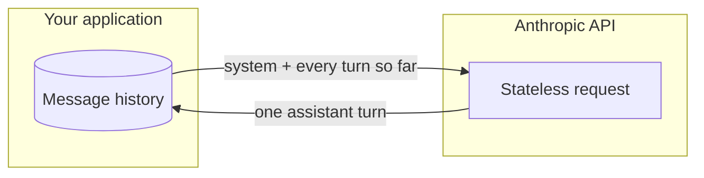
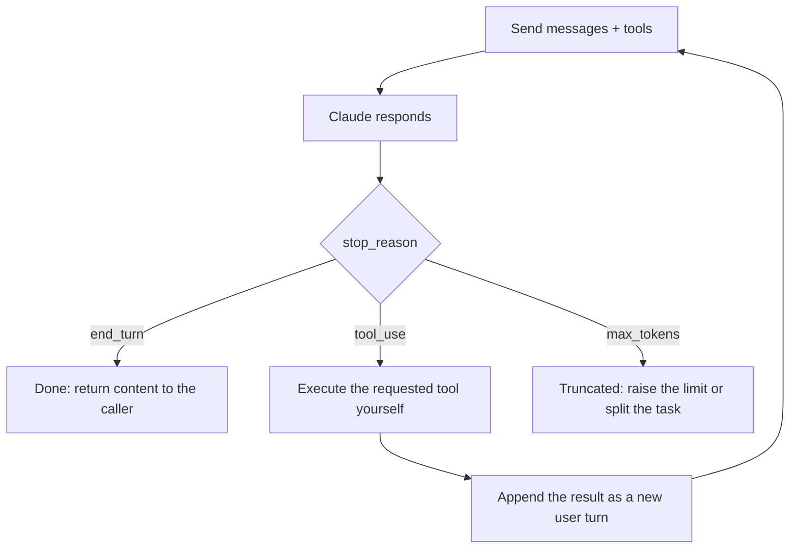
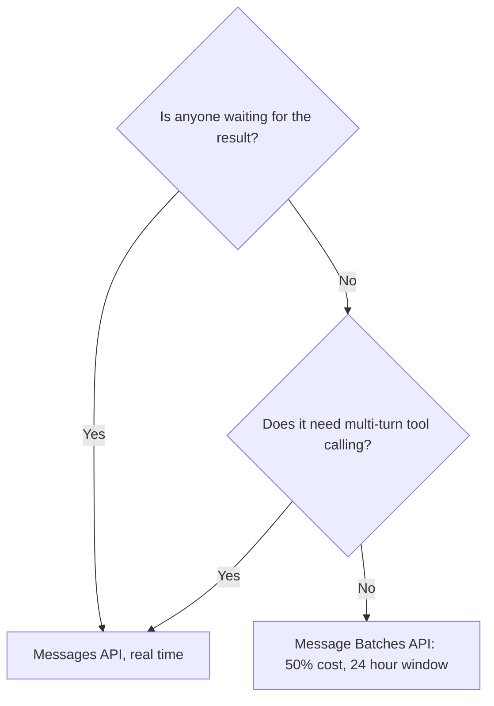
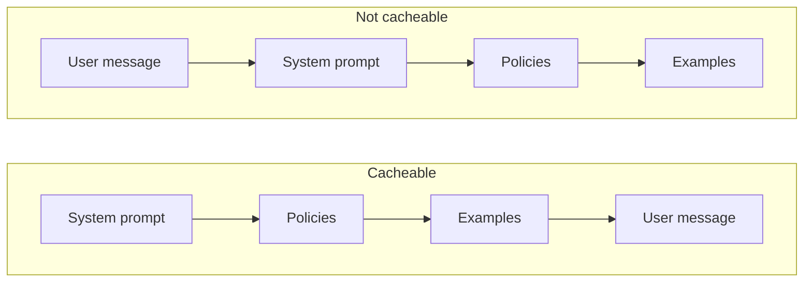

# Study notes: Developer – Foundations

My working notes from preparing for this exam, organized by what the published skill weights say deserves attention. They condense what matters; they do not replace the [exam guide](exam-guide.pdf), and nothing here comes from the live exam, which is covered by a non-disclosure agreement.

The weight math that should drive your time: Applications and Integration (33.1%) plus Model Selection and Optimization (16.8%) plus Agents and Workflows (14.7%) is nearly two thirds of the exam. Claude Code (3.1%) and Eval, Testing, and Debugging (2.6%) together are barely three questions' worth.

## API mechanics (the core 6.8% plus everything it touches)

- **Messages API**: conversation state lives client side; you send the full message history each call. System prompts set persistent behavior; user and assistant turns carry the dialogue.

**Where the conversation lives.** There is no session on the server. You hold
the history and resend it, which is why a long conversation costs more per turn
than a short one.

- **stop_reason** is the control signal: `end_turn` means done, `tool_use` means execute the requested tool and return the result in a new user turn. An agent loop is exactly this cycle.

**The tool loop.** This cycle is the whole of agentic behavior on the API.
`stop_reason` drives it, and an agent is this loop repeated until `end_turn`.

Two things the diagram makes obvious that the prose does not. You execute the
tool, not Claude. And the result goes back as a **user** turn, which is why the
history grows on every pass.

- **Streaming** cuts perceived latency, not cost. **Vision** and multi-format input arrive as content blocks.
- **Message Batches API**: for latency-tolerant bulk work. 50% of the cost, results within a 24-hour window, correlate with custom_id, no multi-turn tool calling. The batch-versus-realtime tradeoff is a favorite scenario shape: overnight and cost-sensitive means batch.

**Batch or real time.** This is a scenario shape that recurs, and it turns on
one question rather than on cost.

Cost is the consequence, not the criterion. Ask who is waiting first.

- **Prompt caching**: put stable content (system prompt, policies, examples) first, variable content last, so the prefix is reusable. Caching cuts both latency and cost; reordering the prompt is often the whole fix.

**Why the order decides the saving.** The cache matches a prefix. Anything
variable placed early breaks the match for everything after it, so the same
content in the wrong order caches nothing.

In the second arrangement the prefix changes on every request, so nothing after
it can be reused. Reordering is often the entire optimization.

## Model selection and cost (16.8%)

- Haiku for high-volume simple work, Sonnet as the default, Opus when reasoning depth pays for itself. Extended and adaptive thinking and effort levels trade latency for quality on hard problems.
- Tokens are the unit of everything: budget them, track usage, and know that context windows bound the conversation plus the response.
- Model releases can change behavior. Pin model versions in production and treat upgrades as changes requiring evaluation, not drop-ins.

## Agents and workflows (14.7%)

- **Workflow versus agent**: if the steps are known in advance, orchestrate a workflow; reserve an autonomous agent loop for tasks where the model must decide the path. The cheapest reliable structure wins.
- Manager and supervisor hierarchies delegate to subagents; subagents also isolate context so a long investigation does not pollute the main thread.
- Hooks give deterministic control at loop boundaries, which is how you enforce guardrails an LLM cannot be trusted to self-enforce.
- Know what the Claude Agent SDK gives you versus a hand-rolled loop versus frameworks such as LangGraph, Strands, or PydanticAI: the tradeoff is control against convention.

## Tools, Skills, and MCP (10.6%)

The decision table I kept coming back to:

| Need | Reach for |
| --- | --- |
| Capability inside one application | A custom tool with a clear schema |
| Reusable capability across applications, maintained independently | An MCP server |
| Reusable instructions and conventions, not code | A Skill |
| File, shell, and search basics | The built-in tools |

- Tool descriptions are prompts: the model chooses tools by reading them, so similar tools need clearly differentiated descriptions.
- Client-side versus server-side execution and approval patterns for dangerous operations are in scope.

## Prompt, context, and output (11.0% + 2.6%)

- System prompt for durable behavior, user turn for the task. Few-shot examples fix format and edge-case behavior better than more instructions.
- Context drift and bloat are managed by pruning tool outputs, compacting history, and isolating subtasks in subagents.
- Treat model output as untrusted input to your own system: validate structured output against a schema, parse defensively, and retry with the validation error fed back.

## Security (8.1%)

The exam's model answer for prompt injection, worth memorizing as a pattern: treat retrieved or user-supplied content as untrusted data, keep it separated from trusted instructions, and enforce least privilege with guardrails or hooks so injected text cannot trigger sensitive actions. Bigger models, higher temperature, or polite requests in the system prompt are all wrong answers. Secrets live in managed stores, never in prompts or code; PII gets minimized before it reaches the model.

## Recall list

53 questions, 120 minutes, 720 of 1,000 to pass, closed book, $125 list, counts toward partner tier eligibility, credential valid 12 months with free renewal, retake waits of 14, 30, then 90 days.

---

These notes are the maintainer's own summary and carry no official standing. [Study guide](README.md) · [Repository index](../README.md)
