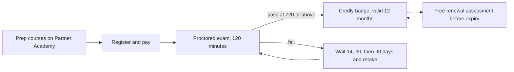

# Program guide

Everything about the certification program that is not specific to a single exam. The four certifications each have their own folder at the repository root with a study guide, the official exam guide PDF, study notes, and practice questions.

The whole journey, end to end:

| Page | Read it when |
| --- | --- |
| [Is it worth it](is-it-worth-it.md) | An honest answer, including when the answer is no |
| [How it compares](compared.md) | The Claude program against other AI and cloud certifications |
| [Learning paths and courses](learning-paths.md) | Choosing a certification, or picking courses to prepare with |
| [Anthropic courses](courses.md) | All 24 official courses: what each teaches, where to enroll, and which exam it serves |
| Cheat sheets ([Associate](../associate-foundations/cheat-sheet.md), [Developer](../developer-foundations/cheat-sheet.md), [Architect F](../architect-foundations/cheat-sheet.md), [Architect P](../architect-professional/cheat-sheet.md)) | One printable page per exam: facts, weights, the rules that decide questions, timing, and traps |
| [Course notes](course-notes.md) | The maintainer's take on each course: what it is worth, what to watch for, and the order to take them |
| [Study strategy](study-strategy.md) | You have chosen an exam and want a plan |
| [Official resources](resources.md) | Anthropic's documentation, courses, engineering articles, videos, and code, mapped to each exam |
| [Progress tracker](tracker.md) | Tick each domain as you cover it; progress is weighted by exam share |
| [Practice engine](quiz.md) | A shuffled, timed, scored exam drawn from the 100-question bank, in the browser or a terminal |
| [Practice with Claude](practice.md) | Generating blueprint-based practice questions with Claude, within the exam NDA |
| [Registration and scheduling](registration.md) | Booking the exam, fixing partner email issues, preparing your machine |
| [Certification policies](policies.md) | Retakes, validity, renewal, appeals, proctoring rules |
| [Frequently asked questions](faq.md) | Quick answers, from pricing to badges |
| [Things that get mixed up](confusions.md) | The pairs these exams actually test, and the question that separates each |
| [Glossary](glossary.md) | The program's terms, defined once |
| [Program changes](program-changes.md) | A dated record of what Anthropic has changed, and who it affects |
| [Official sources](official-sources.md) | Provenance of every mirrored PDF |
| [Prompts for Claude](prompts.md) | Copyable prompts that turn Claude into a tutor: diagnostics, drills, plans, and score analysis |
| [Official videos](videos.md) | Anthropic's own videos, arranged by exam, including the complete AI Fluency course |
| [Flashcards](flashcards.md) | Every fact, weight, and rule as a deck for Anki, Quizlet, or RemNote |
| [Share this](share.md) | Links, ready-to-use copy, and images for passing this on |
| [Maintenance guide](maintenance.md) | Contributing to or maintaining this repository |

Official PDFs in this folder: the [Anthropic Certification Exam Policy](anthropic-certification-exam-policy.pdf), the [Certification Terms and Conditions](certification-terms-and-conditions.pdf), and the illustrated [Exam Registration Guide](exam-registration-guide.pdf). Each certification's exam guide sits in that certification's folder.

---

Facts last verified against the official sources on 2026-09-05. [Repository index](../README.md)
