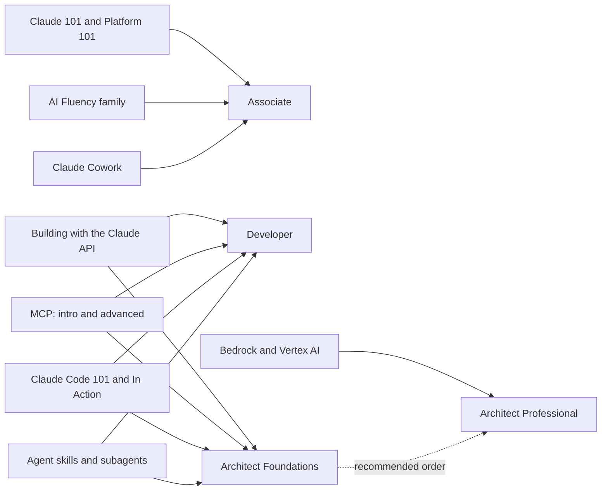

# Course notes

What I took away from each of the 22 courses, and which exam domains it serves. These are working notes, not summaries of the course material: enough to decide what to take, in what order, and what to watch for while taking it. Enrollment links and certificates are in [Anthropic courses](courses.md).

## How the courses map to the exams

## Claude platform

**Claude 101.** The orientation course. Take it first even if you have used Claude for months, because it names things precisely: Projects, Artifacts, research mode, and where each fits. The Associate exam's Product and Model Selection domain is largely this vocabulary applied to scenarios. Watch for the sections on when *not* to reach for a feature.

**Claude Platform 101.** Wider than Claude 101: how the products relate and where the platform boundaries sit. Useful for Associate candidates who need to explain Claude to stakeholders, and worth an hour for Architect candidates who have only ever seen the API.

**Claude Code 101.** The mechanics: installing, running, and working in a session. Short. If you already use Claude Code daily, skim it and go to Claude Code in Action instead.

**Claude Code in Action.** The one that changes how you work. It covers steering long sessions, configuration, automation, and verification, which is precisely the Architect Foundations domain on Claude Code configuration and workflows. Take it with a real repository open and configure as you go; the material rewards doing rather than watching.

**Introduction to Claude Cowork.** The task loop, plugins and skills, and how to steer multi-step work responsibly. Most relevant to Associate candidates and to anyone whose day job is documents and research rather than code.

## Developer and integration

**Building with the Claude API.** The core Developer course and the highest-value hour on this list, because Applications and integration is a third of that exam. Pay closest attention to the parts you would otherwise skim: streaming, batch versus realtime, prompt caching, and error handling. Those are exam-heavy and easy to assume you already know.

**Introduction to Model Context Protocol.** Builds a server and a client in Python from nothing, which is the fastest way to make MCP concrete. Both Architect exams test MCP judgment (tool descriptions, error shapes, when a server is the right unit of reuse) and that judgment is difficult to fake without having built one.

**Model Context Protocol: Advanced Topics.** Sampling, notifications, file system access, and transports. Skip it for the Associate exam. Take it for Architect Professional, where integration and protocol selection carry the most weight.

**Introduction to agent skills.** Skills are instructions, not code, and this course draws that line clearly. The distinction between a Skill, a custom tool, and an MCP server is a repeated exam theme; this is where it clicks.

**Introduction to subagents.** Short and important. Subagents exist to delegate and to isolate context, and context isolation is the answer to several Architect Foundations reliability questions. Take it right after the MCP intro.

## Deployment platforms

**Claude with Amazon Bedrock.** Originally built as an accreditation for AWS, so it is more rigorous than a platform tour. Take it if your customers run on AWS, or for Architect Professional where deployment platform choice is part of solution design.

**Claude on Google Cloud.** The same ground on Vertex AI. Take whichever matches your work; take both only if you advise across clouds.

## AI Fluency

**AI Fluency: Framework & Foundations.** The framework the whole family builds on: collaborating with AI effectively, efficiently, ethically, and safely. It reads as soft material and is not. The Associate exam's two heaviest domains, output evaluation and governance, are this framework applied under pressure.

**AI Capabilities and Limitations.** Where models fail and why. This is the intellectual backbone of every question that asks you to verify a claim, spot a hallucination, or decide something needs human review. If you take only one AI Fluency course before the Associate exam, take this one after the framework.

**AI Fluency for Builders.** The framework for people shipping AI features. Useful bridge material if you are moving from the Associate track toward Developer.

**AI Fluency for educators**, **for pK-12 Educators**, **for students**, **for nonprofits**, **for Small Businesses**, and **for Creative Work.** Six role-specific editions of the same framework. Take the one matching your context; they do not stack, and taking several adds repetition rather than depth.

**Teaching AI Fluency.** For teaching and assessing the framework in instructor-led settings. Outside exam scope, valuable if you train others, and the clearest sign that you have genuinely absorbed the framework is being able to teach it.

## How I would sequence them

Everyone: Claude 101, then AI Fluency: Framework & Foundations, then AI Capabilities and Limitations.

Associate candidates stop there and add Claude Cowork plus the role-specific AI Fluency edition that matches their work.

Developer and Architect candidates continue: Building with the Claude API, Introduction to MCP, Claude Code 101, Claude Code in Action, agent skills, subagents. Architect Professional candidates add MCP Advanced Topics and the cloud course matching their platform.

The [prep paths on Partner Academy](learning-paths.md#certification-prep-courses) sequence these officially per exam; this is the order I would use if I were starting again.

---

Facts last verified against the official sources on 2026-09-05. These notes are the maintainer's own. Course facts come from the [official catalog](courses.md). [Repository index](../README.md)
