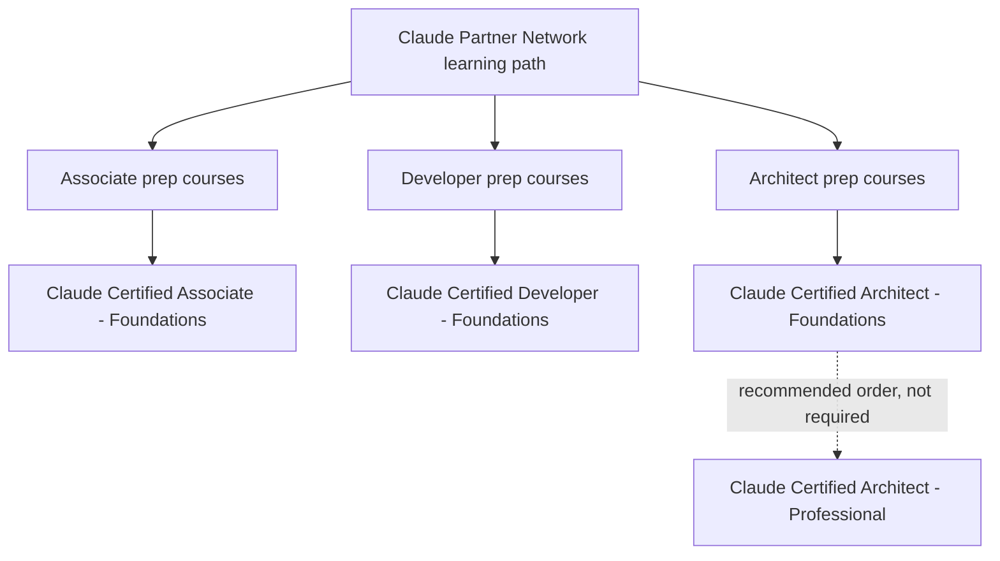

# Learning paths and courses

The certification program is backed by free courses on [Anthropic Partner Academy](https://anthropic-partners.skilljar.com/). This page maps how the pieces connect: the Claude Partner Network learning path, the per-certification prep courses, and the public course catalog.

## How the certifications connect

There are three roles and four certifications. Foundations is the entry level for each role; the Architect role adds a Professional level. There are no formal prerequisites anywhere: you can sit any exam directly, and Architect – Foundations does not upgrade into Architect – Professional.

Which role fits:

| Role | For | Certifications |
| --- | --- | --- |
| Associate | Consultants, sellers, and delivery leads who guide customers toward the right Claude use cases | [Associate – Foundations](../associate-foundations/README.md) |
| Developer | Engineers who build with the Claude API, Claude Code, and MCP, from first integration to production agents | [Developer – Foundations](../developer-foundations/README.md) |
| Architect | Partners who design Claude solutions end to end: deployment platforms, agentic architectures, evaluation, cost, and safety | [Architect – Foundations](../architect-foundations/README.md), [Architect – Professional](../architect-professional/README.md) |

Note: the Associate exam does not count toward Claude Partner Network tier eligibility. The Developer and both Architect exams do.

## Claude Partner Network learning path

The [CPN learning path](https://anthropic-partners.skilljar.com/page/claude-partner-network-learning-path) is the introductory foundation for new partners and the first step toward certification. It contains four courses:

1. [Introduction to agent skills](https://anthropic-partners.skilljar.com/introduction-to-agent-skills): building, configuring, and sharing Skills in Claude Code
2. [Building with the Claude API](https://anthropic-partners.skilljar.com/claude-with-the-anthropic-api): working with Anthropic models through the API
3. [Introduction to Model Context Protocol](https://anthropic-partners.skilljar.com/introduction-to-model-context-protocol): building MCP servers and clients in Python, covering tools, resources, and prompts
4. [Claude Code in Action](https://anthropic-partners.skilljar.com/claude-code-in-action): running long, hands-off Claude Code sessions with steering, configuration, automation, and verification

## Certification prep courses

Each certification has a dedicated prep path on the [prep courses page](https://anthropic-partners.skilljar.com/page/claude-certification-exam-prep-courses):

| Certification | Prep path | Size |
| --- | --- | --- |
| Associate – Foundations | [Associate prep path](https://anthropic-partners.skilljar.com/path/claude-certified-associate-foundations) | 8 courses |
| Developer – Foundations | [Developer prep path](https://anthropic-partners.skilljar.com/path/claude-certified-developer-foundations) | 5 courses |
| Architect – Foundations | [Architect Foundations prep courses](https://anthropic-partners.skilljar.com/page/claude-certified-architect-foundations-prep-courses) | See page |
| Architect – Professional | [Architect Professional prep path](https://anthropic-partners.skilljar.com/path/claude-certified-architect-professional) | 5 courses |

Prep coverage varies by certification and Anthropic adds prep content over time, so check the page for your exam close to your test date. In every case the exam guide, not the prep path, defines the exam scope.

## Course catalog

Every course with its description, enrollment link, exam relevance, and a verified completion certificate is cataloged in [Anthropic courses](courses.md). The summary by theme:

Courses visible in the [public catalog](https://anthropic-partners.skilljar.com/page/all-courses), grouped by theme. Completion of a course earns a certificate; the maintainer's certificates for these courses are in the [certificates directory](../certificates/README.md).

Claude platform:

| Course | Covers |
| --- | --- |
| [Claude 101](https://anthropic-partners.skilljar.com/claude-101) | Using Claude for everyday work tasks and core features |
| [Claude Code 101](https://anthropic-partners.skilljar.com/claude-code-101) | Claude Code in the daily development workflow |
| [Claude Code in Action](https://anthropic-partners.skilljar.com/claude-code-in-action) | Long, hands-off Claude Code sessions: steer, configure, automate, verify |
| [Introduction to Claude Cowork](https://anthropic-partners.skilljar.com/introduction-to-claude-cowork) | The Cowork task loop, plugins and skills, file and research workflows |

Developer and integration:

| Course | Covers |
| --- | --- |
| [Building with the Claude API](https://anthropic-partners.skilljar.com/claude-with-the-anthropic-api) | The full span of working with Anthropic models through the API |
| [Introduction to Model Context Protocol](https://anthropic-partners.skilljar.com/introduction-to-model-context-protocol) | MCP servers and clients from scratch in Python |
| [Model Context Protocol: Advanced Topics](https://anthropic-partners.skilljar.com/model-context-protocol-advanced-topics) | Sampling, notifications, file system access, transports, production servers |
| [Introduction to agent skills](https://anthropic-partners.skilljar.com/introduction-to-agent-skills) | Building, configuring, and distributing Skills |
| [Introduction to subagents](https://anthropic-partners.skilljar.com/introduction-to-subagents) | Using and creating subagents for context management and delegation |

Deployment platforms:

| Course | Covers |
| --- | --- |
| [Claude with Amazon Bedrock](https://anthropic-partners.skilljar.com/claude-in-amazon-bedrock) | Running Claude on AWS, from the AWS accreditation program |
| [Claude on Google Cloud](https://anthropic-partners.skilljar.com/claude-with-google-vertex) | Working with Anthropic models on Google Cloud and Vertex AI |

AI Fluency:

| Course | Covers |
| --- | --- |
| [AI Fluency: Framework & Foundations](https://anthropic-partners.skilljar.com/ai-fluency-framework-foundations) | Collaborating with AI effectively, efficiently, ethically, and safely |
| AI Fluency for educators, pK-12 educators, students, nonprofits, small businesses, and builders | Role-specific adaptations of the framework |
| Teaching AI Fluency | Teaching and assessing AI Fluency in instructor-led settings |

Partner-exclusive content, such as the [Partner Basecamp](https://anthropic-partners.skilljar.com/partner-basecamp) program, the CPN Connect broadcast library, and model launch briefings, requires a partner sign-in and is visible from the [Academy home page](https://anthropic-partners.skilljar.com/).

## Partner badges

Separate from certifications, partners can earn specialty badges. The [Claude Code partner badge](https://anthropic-partners.skilljar.com/path/partner-badge-claude-code) is a ten-course path covering deployment architecture, extensibility, security and governance, and delivery methodology, with a capstone. Badges are listed on the [partner badges page](https://anthropic-partners.skilljar.com/page/partner-badges).

## Suggested sequencing

This is the repository's recommendation, not an official rule:

1. New to the program entirely: work the CPN learning path first. Its four courses underpin every technical exam.
2. Then follow the prep path for your chosen certification, and study its exam guide as the definitive scope.
3. Developer and Architect candidates benefit from the same core courses (API, MCP, Claude Code); if you plan to take more than one exam, that shared foundation makes back-to-back scheduling efficient.
4. Architect – Professional adds governance, evaluation, and stakeholder material that the courses cover more thinly; plan additional hands-on time with an end-to-end system. See [Study strategy](study-strategy.md).

---

Facts last verified against the official sources on 2026-09-05. [Repository index](../README.md)
