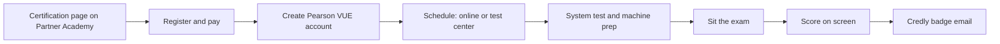
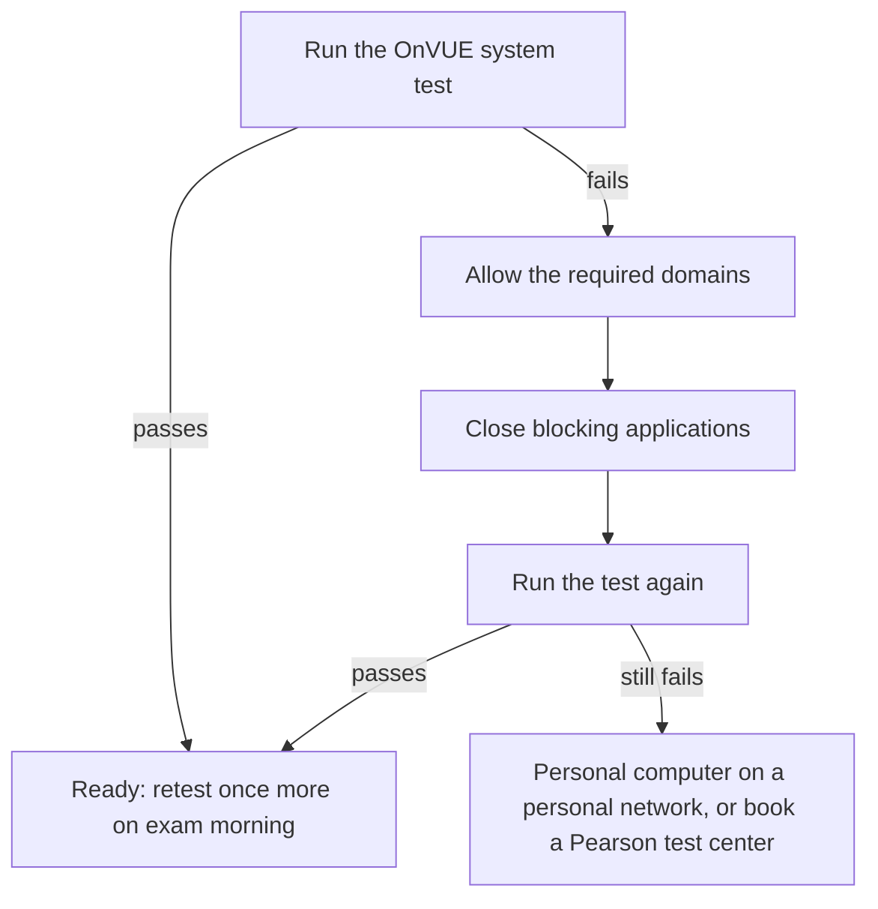
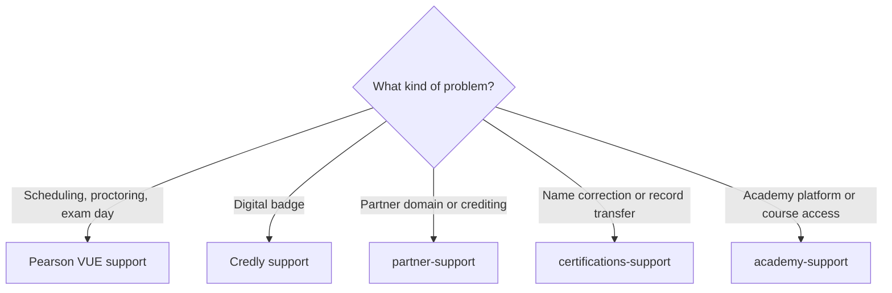

# Registration and scheduling

Exams are purchased through Anthropic Partner Academy and delivered by Pearson VUE, either online proctored through OnVUE or at a Pearson test center. This page covers the full path from registration to exam day, including the computer and network preparation that most often causes problems.

Official references: the [exam registration guide](exam-registration-guide.pdf) (PDF with screenshots of every step) and the [computer and network setup page](https://anthropic-partners.skilljar.com/page/computer-and-network-setup).



## Eligibility

Certification is currently available only to people at Claude Partner Network organizations. Registration requires signing in with a company email on a domain recognized in your organization's partner record. Personal email addresses do not work.

If you see "You aren't signed in with a partner company employee email", check that you used your company address. If the error persists, email [partner-support@anthropic.com](mailto:partner-support@anthropic.com). Domain changes take 7 to 10 days, so resolve this well before you plan to sit the exam. The same applies if your company uses several domains: certify under the recognized one, or ask for the others to be rolled up to your parent domain, otherwise the certification will not credit to your partner account.

> [!WARNING]
> Partner domain record changes take 7 to 10 days. If your company email is not recognized, or a partner discount does not appear at checkout, resolve it well before you plan to sit the exam rather than on the day.

You must be at least 18 years old to sit a Claude certification exam.

> [!NOTE]
> **A registration stays valid for five years.** Once you buy an exam there is no
> deadline to schedule it, so an unused registration does not lapse at the end of
> the year. Source: the official [certifications FAQ](https://anthropic-partners.skilljar.com/page/faq-certifications).

## Registering

1. Open the page for your certification from the [certifications overview](https://anthropic-partners.skilljar.com/page/partner-certifications).
2. Download and read the exam guide, the [terms and conditions](certification-terms-and-conditions.pdf), and the [exam policy](anthropic-certification-exam-policy.pdf). Registering constitutes acceptance of all three.
3. Register and pay by credit card. Any partner-tier discount is applied automatically at checkout. If a discount you expect is missing, see the [FAQ on pricing](faq.md#pricing-and-discounts) before paying.
4. Follow the confirmation email to create your Pearson VUE account and sign in.
5. Schedule your session: pick a date, and choose online proctoring or a test center.

The name on your Pearson registration must exactly match the name on the government-issued photo ID you will present. To correct a name, email [certifications-support@anthropic.com](mailto:certifications-support@anthropic.com) before scheduling.

[](../.github/assets/card-registration.png "View the registration summary at full size")

## Rescheduling and cancelling

You can reschedule or cancel up to 24 hours before the appointment. Inside 24 hours, or if you do not show up, the exam fee is forfeited.

## Preparing your computer for an online proctored exam

Online exams run through Pearson's OnVUE application on your own computer with a remote proctor. Work through these steps days before the appointment, not on exam day. None of this applies at a test center, where equipment is provided.

### 1. Run the system test

Run the [OnVUE system test](https://system-test.onvue.com/system_test?customer=pearson_vue&clientcode=ANTHROPIC&locale=en_US) on the same computer and network you will use for the exam, and review [Pearson's OnVUE requirements for Anthropic](https://www.pearsonvue.com/us/en/anthropic/onvue.html). Two cautions from the official setup page: a passing test does not guarantee a problem-free exam, and a reported network error is often actually a blocked domain or a running application, so work through the next two steps before troubleshooting your connection.

### 2. Confirm required domains are reachable

These domains, including all subdomains, must be reachable from your network for OnVUE delivery. On a corporate network, send the list to your network administrator early.

```text
*.ably-realtime.com   *.ably.io            *.certiport.com
*.gettesting.com      *.onvue.com          *.pdricloud.net
*.pearson.com         *.pearsonvue.com     *.programworkshop.com
*.programworkshop2.com *.pvue1.com         *.pvue2.com
*.startpractice.com   *.starttest.com      *.starttest2.com
*.twilio.com          *.verifyreadiness.com *.wowza.com
```

### 3. Close applications that block the exam

OnVUE may refuse to launch while certain software is running. The official list is long and includes browsers (Chrome, Edge), communication tools (Zoom, Teams, Webex, Discord, Outlook), remote access software (AnyDesk, Chrome Remote Desktop, Splashtop, TeamViewer-class tools, Tailscale), screen capture tools, and the Claude desktop application itself. On macOS the list includes jamfhelper, Microsoft AutoUpdate, Microsoft Defender, osascript, and Screenshot. Some of these run as background services that only your IT team can stop; ask early rather than on exam day. The complete list is on the [computer and network setup page](https://anthropic-partners.skilljar.com/page/computer-and-network-setup).

### If a corporate machine will not cooperate

The whole troubleshooting path, in order:



The official recommendation when the corporate machine cannot be fixed is one of two alternatives: use a personal computer on a personal network, or book a Pearson test center instead.

## Identity and your Pearson profile

The check that stops people at the door is not technical. It is the name on the account.

- **The name on your Pearson VUE profile must match your government-issued ID exactly.** You are asked to confirm this during registration, before you schedule.
- **A mismatch at check-in means you do not test.** Pearson will refuse entry, and under their policy the fee is forfeited.
- **Request a name correction more than 24 hours before the exam.** Inside that window there may not be time to apply it.
- **A correction requested after a refused entry does not undo the forfeit.** You pay again to reschedule, so fix the name the day you register rather than the day you sit.
- **Bring a valid, unexpired government-issued ID**, whether you test online or at a test center. Pearson publishes the accepted forms.

Two fields on that profile are not part of the check and cause avoidable alarm:

- **The address and phone number do not need to be yours.** They are not used to verify identity.
- **The phone number will be an Anthropic corporate number you do not recognize.** It is added to every candidate profile deliberately, it is never used to contact you, and Anthropic cannot change it. Leave it alone.

## Exam day

[](../.github/assets/card-exam-day.png "View the exam-day checklist at full size")

- Have a valid, unexpired government-issued photo ID whose name exactly matches your registration.
- For online exams: a private room, a clear desk, and a stable connection. You must stay in webcam view for the whole session.
- Prohibited: phones, smart watches, headphones, notes, books, secondary monitors, and recording devices. Exams are closed book, and browser translation tools are not permitted.
- Plan for about 135 minutes of seat time: check-in, 120 minutes of testing, and a short post-exam survey.
- Before the exam starts you must accept a confidentiality and non-disclosure agreement. Declining ends the session without a refund.

## Results and your badge

Your score appears on screen at the end of the exam; test centers also print a score report. Results are reported as a scaled score from 100 to 1,000, with 720 required to pass, plus a percent-correct breakdown per domain. If you pass, Credly emails you an invitation to claim your digital badge, usually within minutes for online exams. Add a personal email address to your Credly profile so the badge stays with you if you change employers.

## Accommodations

Testing accommodations are requested through [Pearson's accommodation process for Anthropic](https://www.pearsonvue.com/us/en/test-takers/accommodations/pearson_approve.anthropic.html) and must be approved before you schedule. Plan to request them at least 10 days before your intended exam date. Accommodations have no effect on scoring.

## Where to get help



| Issue | Contact |
| --- | --- |
| Registration, scheduling, proctoring, exam day | [Pearson VUE support for Anthropic](https://www.pearsonvue.com/us/en/anthropic.html) |
| Name corrections on a registration | [certifications-support@anthropic.com](mailto:certifications-support@anthropic.com) |
| Partner domain recognition, certifications not crediting to your partner account | [partner-support@anthropic.com](mailto:partner-support@anthropic.com) |
| Digital badge problems | [Credly support](https://support.credly.com) |
| Academy platform and course access | [academy-support@anthropic.com](mailto:academy-support@anthropic.com) |

---

Facts last verified against the official sources on 2026-09-05. [Repository index](../README.md)
