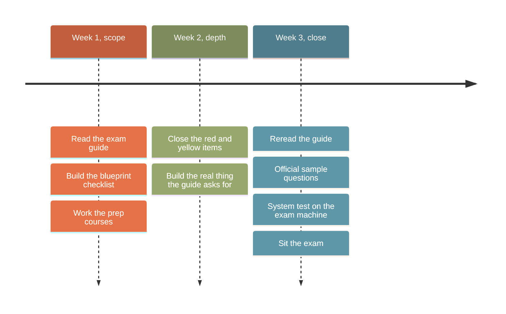

# Study strategy

Everything on this page is recommendation, written from having worked through the program's curriculum. The facts it leans on come from the official exam guides; where a claim is official, it links to the source. Treat the exam guide for your certification as the syllabus and this page as the method.

## The method, in short

1. **Pick the right exam for your role**, not the most impressive one. The [role table](learning-paths.md#how-the-certifications-connect) settles this quickly. Certifications expire after 12 months, so certify against the work you actually do.
2. **Read the exam guide twice.** Once end to end before anything else, once again after studying. Every guide states that the blueprint is the authoritative scope: if a topic is not in the blueprint, it is not on the exam.
3. **Turn the blueprint into a checklist.** Copy the domain objectives into a document and mark each one red, yellow, or green for your current confidence. Study red items first, weighted by the domain percentages. The weights differ sharply between exams; the [Developer blueprint](../developer-foundations/README.md#skills-measured) even publishes per-skill weights, which makes time allocation mechanical.
4. **Do the work, not just the reading.** All four guides say the same thing in their preparation sections: build something real. The exams test judgment in scenarios, and judgment comes from having hit the tradeoffs yourself.
5. **Use the sample questions as calibration, not practice.** There is no practice exam. Each guide has three or more official samples with rationales. The rationales matter more than the questions: they show what the exam considers a wrong answer and why. To drill beyond the samples without touching the NDA, generate your own questions from the blueprint using [Practice with Claude](practice.md).
6. **Book the exam once your checklist is mostly green.** An open purchase has no scheduling deadline, and rescheduling is free until 24 hours out, so booking early costs nothing and sets a deadline.

> [!IMPORTANT]
> The exam guide for your certification is the authoritative scope. Every guide states it plainly: if a topic is not in the blueprint, it is not on the exam. Study the blueprint before any course.

## Per-certification emphasis

**[Associate – Foundations](../associate-foundations/README.md).** The heaviest domain is evaluating outputs (21%), not writing prompts (14%). Practice reviewing Claude's answers for fabricated details, verifying claims against sources, and deciding what needs human review. Build at least one Project with instructions and knowledge sources. The governance domain rewards knowing when not to upload sensitive data and how to anonymize.

**[Developer – Foundations](../developer-foundations/README.md).** A third of the exam is Applications and integration, so API mechanics deserve the most time: messages, streaming, caching, batch versus realtime, and schema design. Do not over-invest in Claude Code and debugging, which together are under 6%. Build one application end to end that calls the API, uses a tool, and validates structured output.

**[Architect – Foundations](../architect-foundations/README.md).** The six exam scenarios are published, and four appear per sitting. Study the scenarios until each one's likely questions are predictable, then do the guide's own preparation exercises. The appendix names specific testable items (stop_reason values, isError, fork_session, --json-schema); go down that list and verify you can explain each one.

**[Architect – Professional](../architect-professional/README.md).** More than half the exam is integration, solution design, and evaluation. Build or dissect an end-to-end system with RAG, evaluation, and observability. Do not neglect the soft domains: stakeholder communication and governance are 28% combined, and the sample rationales reward defensible, least-privilege, justified decisions.

## A sensible three-week shape

For one Foundations exam alongside a full-time job. Compress or stretch to fit; this is structure, not prescription.

- **Week 1: scope.** Read the exam guide fully. Build the blueprint checklist. Complete the [prep courses](learning-paths.md#certification-prep-courses) for your exam, marking checklist items green as they are covered.
- **Week 2: depth.** Work the red and yellow checklist items through documentation and hands-on building. This is the week to build the real thing the guide asks for: a Project, an application, an agent, or an extraction pipeline depending on your exam.
- **Week 3: close.** Reread the guide. Work the sample questions and rationales. Rerun the [system test, network checks, and application shutdown list](registration.md#preparing-your-computer-for-an-online-proctored-exam) on the machine you will test with. Sit the exam early in a day when you are fresh.

The [progress tracker](tracker.md) keeps this checklist for you in the browser, weighted by how much of the exam each domain carries.

## Exam week checklist

- [ ] Name on Pearson registration exactly matches your photo ID
- [ ] Accommodations, if needed, approved before scheduling
- [ ] OnVUE system test passed on the exam machine and network
- [ ] Corporate network domains cleared with IT, or a personal machine and network arranged
- [ ] Know the shutdown list: browsers, Zoom, Teams, Outlook, Discord, remote-access tools, and the Claude desktop app
- [ ] Private room arranged, desk clear, second monitor disconnected
- [ ] Reschedule decision made no later than 24 hours out, since after that the fee is forfeited

## During the exam

- 120 minutes for 53 to 63 questions is roughly two minutes each. Flag and move on rather than stalling; unanswered questions score zero, so answer everything.
- Multiple-response items state how many responses to select. Read that line first.
- Scenario questions reward the best answer among defensible ones. The official rationales consistently prefer the option that addresses the stated constraint (cost, privacy, least privilege) over the generically reasonable one.
- If a question seems faulty, note its number mentally and [report it afterward](policies.md#reporting-a-problem-with-a-question); reporting never hurts your result.

## After the exam

- Passed: claim the Credly badge from the email, add a personal address to your Credly profile, and diary the 12-month renewal so the free assessment is not missed.
- Failed: the score report shows percent-correct per domain. Rebuild the checklist from the weakest domains, use the waiting period (14 days on a first attempt) deliberately, and note that the fee applies again.
- Either way, the [NDA](policies.md#confidentiality) applies: do not share exam questions, including in this repository's discussions.

---

Facts last verified against the official sources on 2026-09-05. [Repository index](../README.md)
