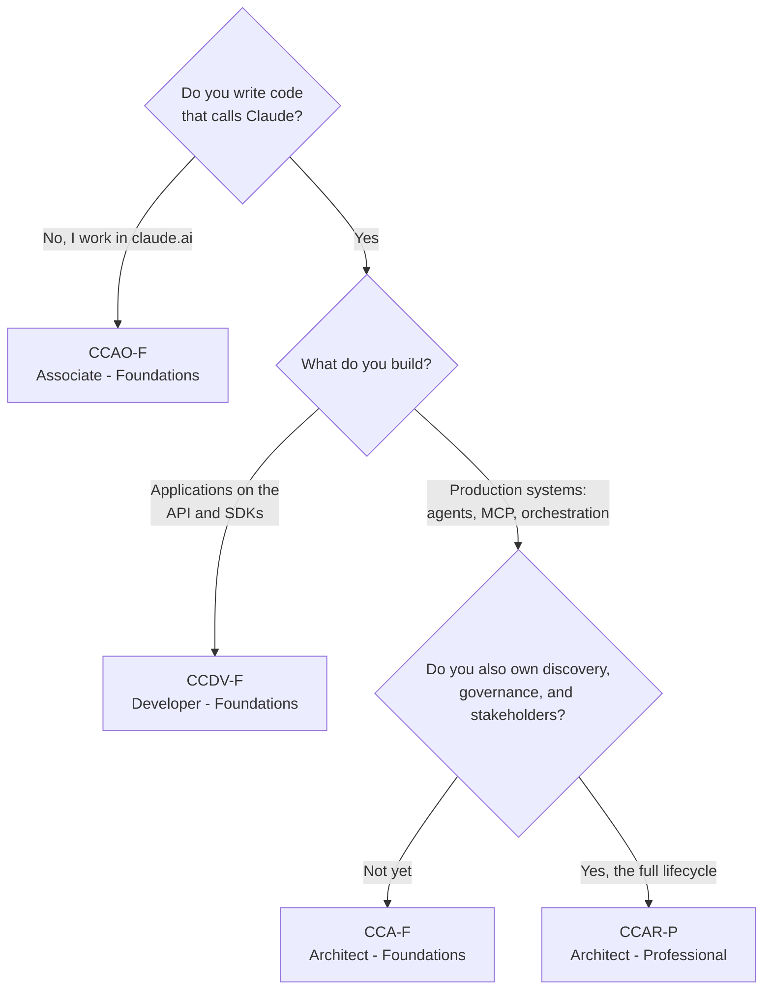

# Claude Certification Guide

Study guides for all four Anthropic Claude certifications: **CCAO-F**, **CCDV-F**, **CCA-F**, and **CCAR-P**. Exam domains and weights, comparison, decision framework, study paths, and free practice resources.

Anthropic's certification program launched with a single exam (Claude Certified Architect - Foundations, March 12, 2026) and expanded on July 23, 2026 into a role-based program with four credentials. The names are similar, the prices are similar, and choosing wrong wastes an exam fee on a blueprint written for a different job. This repo exists to make that choice obvious and the preparation efficient.

*Exam facts (prices, question counts, domains) current as of August 2026 — see [About](#about) for the full disclaimer.*

## Contents

- [The four certifications compared](#the-four-certifications-compared)
- [Which one should you take?](#which-one-should-you-take)
- [How the program works](#how-the-program-works)
- [Typical preparation timelines](#typical-preparation-timelines)
- [In this repo](#in-this-repo)
- [Free resources](#free-resources)
- [Contributing](#contributing)
- [About](#about)

## The four certifications compared

| Code | Certification | Price | Questions | Audience | Level | Study guide |
|------|---------------|-------|-----------|----------|-------|-------------|
| [CCAO-F](./ccao-f/) | Claude Certified Associate - Foundations | $99 | 60 | Business professionals using claude.ai as a productivity tool | Foundations | [📖 Guide](./ccao-f/guide.md) |
| [CCDV-F](./ccdv-f/) | Claude Certified Developer - Foundations | $125 | 53 | Engineers building applications on the Claude API and SDKs | Foundations | [📖 Guide](./ccdv-f/guide.md) |
| [CCA-F](./cca-f/) | Claude Certified Architect - Foundations | $125 | 60 | Builders of production-grade Claude and agent systems | Foundations | [📖 Guide](./cca-f/guide.md) |
| [CCAR-P](./ccar-p/) | Claude Certified Architect - Professional | $175 | 63 | Solution architects owning the full Claude solution lifecycle | Professional | [📖 Guide](./ccar-p/guide.md) |

Every exam shares the same skeleton: **120 minutes**, delivery through **Pearson VUE** (test center or online proctored), scaled scoring from 100 to 1000 with a **720 passing bar**, all questions scored, English only, and roughly a quarter of the questions in multiple-response format ("Select TWO" or "Select THREE").

The cleanest way to read the table is as two tracks:

- **Horizontal (three Foundations exams):** different roles at similar depth. CCAO-F for people who use the claude.ai product, CCDV-F for people who program against the Claude platform, CCA-F for people who assemble those pieces into production systems.
- **Vertical (the architect ladder):** CCA-F tests whether you can build a system correctly; CCAR-P tests whether you can own the entire solution, from discovery through governance and stakeholder sign-off.

## Which one should you take?

Match the exam to your role. There are no prerequisites and no required order.

| If you are... | Take | Why | Start here |
|---|---|---|---|
| A business professional working inside claude.ai: marketing, ops, PM, comms, analysis | [CCAO-F](./ccao-f/) | The one exam with no code; covers the product you actually use | [Study guide](./ccao-f/guide.md) |
| An engineer building applications on the Claude API, SDKs, or Claude Code | [CCDV-F](./ccdv-f/) | Certifies platform depth: API mechanics, agents, tools | [Study guide](./ccdv-f/guide.md) |
| A builder of production Claude systems: agent architectures, MCP servers | [CCA-F](./cca-f/) | Implementation-level architecture, scenario-anchored format | [Study guide](./cca-f/guide.md) |
| The architect accountable for the whole solution lifecycle, 3+ years experience | [CCAR-P](./ccar-p/) | Adds discovery, governance, evaluation, and stakeholder ownership | [Study guide](./ccar-p/guide.md) |

**Stacking:** combinations make sense when they certify different parts of one job. CCA-F + CCAR-P is the deliberate two-tier architect path, and CCDV-F + CCA-F suits engineers who both build applications and design systems, with enough blueprint overlap (MCP, prompting, Claude Code) that the second exam costs meaningfully less study time. Experienced architects can go straight to CCAR-P; most still benefit from the Foundations vocabulary first.

## How the program works

- **Registration** runs through the Anthropic Partner Academy (Anthropic's Skilljar-based learning platform). Access requires membership in the Claude Partner Network, free to join at [claude.com/partners](https://claude.com/partners). The official preparation courses there are also free.
- **Delivery** is proctored by Pearson VUE, at a test center or online from home. Both require identity verification and deliver the identical exam.
- **Scoring** is scaled (100 to 1000, pass at 720). Scaled scoring adjusts for difficulty differences between exam forms, so 720 represents a consistent standard rather than a fixed percentage. Your score report includes a percent-correct breakdown per domain.
- **Credentials** arrive as Credly badges that employers can verify.
- **Validity is one year**, with a free, non-proctored renewal assessment on the Partner Academy before expiration. If the credential lapses, renewal requires a full proctored retake at full price. Set a renewal reminder at month ten on the day you pass; the lapsed-credential retake is the most expensive mistake certified candidates make.

## Typical preparation timelines

| Certification | Typical prep | Baseline that timeline assumes |
|---------------|-------------|-------------------------------|
| CCAO-F | ~3 weeks | Regular professional use of claude.ai |
| CCDV-F | ~4 weeks | 1-5 years engineering, 6+ months Claude or LLM work |
| CCA-F | ~30 days | Hands-on experience building Claude or agent systems |
| CCAR-P | ~6 weeks | 3+ years architecture, 6+ months production Claude or LLM solutions |

Whichever exam you choose, the preparation pattern is the same four layers:

1. **Official courses** on the Anthropic Partner Academy define the vocabulary the exam uses.
2. **Primary sources**: [docs.anthropic.com](https://docs.anthropic.com) for the technical exams, the claude.ai Help Center for CCAO-F.
3. **Build or use the real thing.** Every exam writes its questions from production judgment rather than trivia.
4. **Calibrate with full-length practice tests** under timed conditions, and let per-domain results direct your remaining study time.

## In this repo

Every certification directory contains a summary README plus a **complete study guide**: technology chapters, per-domain exam notes, worked questions with explanations, trap-answer patterns, a study plan, and a pre-exam checklist. These aren't stubs:

| Guide | Chapters | Code examples | Worked questions | Length |
|-------|----------|----------------|-------------------|--------|
| [CCA-F](./cca-f/guide.md) | 8 | 17 | 12 | ~9,200 words |
| [CCDV-F](./ccdv-f/guide.md) | 8 | 11 | 12 | ~6,300 words |
| [CCAO-F](./ccao-f/guide.md) | 7 | 0 (non-technical exam; worked text scenarios instead) | 10 | ~5,100 words |
| [CCAR-P](./ccar-p/guide.md) | 8 | 7 | 12 | ~6,900 words |

- [`cca-f/`](./cca-f/): Claude Certified Architect - Foundations → [complete study guide](./cca-f/guide.md)
- [`ccdv-f/`](./ccdv-f/): Claude Certified Developer - Foundations → [complete study guide](./ccdv-f/guide.md)
- [`ccao-f/`](./ccao-f/): Claude Certified Associate - Foundations → [complete study guide](./ccao-f/guide.md)
- [`ccar-p/`](./ccar-p/): Claude Certified Architect - Professional → [complete study guide](./ccar-p/guide.md)

## Free resources

- Free official prep courses: [Anthropic Partner Academy](https://claude.com/partners)
- Free official Anthropic Academy courses ([full catalog](https://anthropic.skilljar.com/)): [Claude 101](https://anthropic.skilljar.com/claude-101), [Building with the Claude API](https://anthropic.skilljar.com/claude-with-the-anthropic-api), [Claude Code 101](https://anthropic.skilljar.com/claude-code-101), [Introduction to MCP](https://anthropic.skilljar.com/introduction-to-model-context-protocol), [AI Fluency](https://anthropic.skilljar.com/ai-fluency-framework-foundations), and more; each cert guide maps the relevant ones to its exam domains
- Free practice questions for each cert: [CCAO-F](https://preporato.com/certificates/claude-certified-associate-foundations) · [CCDV-F](https://preporato.com/certificates/claude-certified-developer-foundations) · [CCA-F](https://preporato.com/certificates/claude-certified-architect) · [CCAR-P](https://preporato.com/certificates/claude-certified-architect-professional)
- In-depth written guides: [all four certs compared](https://preporato.com/blog/claude-certifications-complete-guide-2026), plus a complete guide, study plan, cheat sheet, and domain breakdown per cert (linked in each directory)

## Contributing

Exam blueprints change and this program is young. If you spot something outdated or wrong, open an issue or a PR. First-person exam experiences (no NDA-violating question content, please) are welcome additions to the per-cert guides.

## About

Maintained by [preporato.com](https://preporato.com), where we build full-length practice tests, 500-card flashcard decks, and auto-graded hands-on projects for these certifications.

Licensed [MIT](./LICENSE). This project is not affiliated with, endorsed by, or sponsored by Anthropic. Claude is a trademark of Anthropic, PBC. Exam facts (prices, question counts, domains) reflect the program as of August 2026 and may change; the Partner Academy is authoritative.
